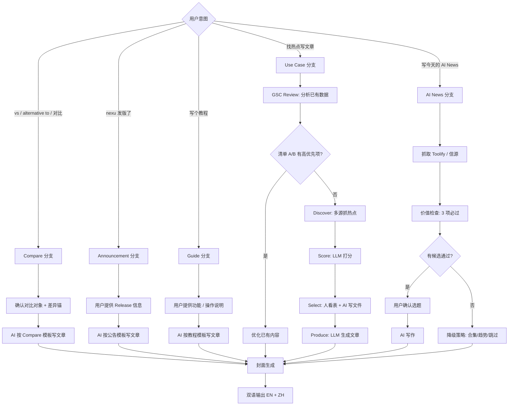
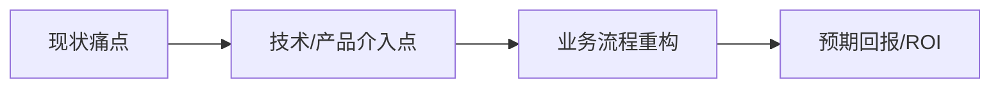
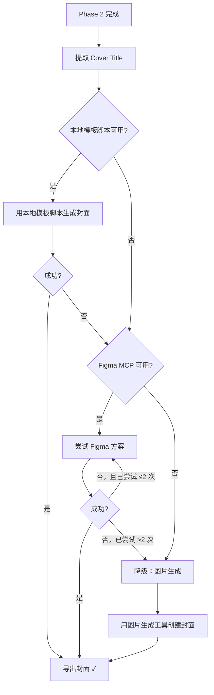

# Ultimate Seo Marketing

> **Agent Instruction:** This is a consolidated expert skill. Read the catalog below and apply the specific rules that match the user's request.

## Skill Catalog

### seo-competitive-analysis
**Description:** Analyze SEO competitors as page systems, not just keyword lists. Use when identifying SEO benchmarks, comparing site architecture and page types, finding high-intent page opportunities, prioritizing compare/channel/problem/use-case pages, or turning product differentiation into an SEO roadmap.


#### SEO Competitive Analysis Skill

You are an expert at SEO competitive analysis for product, growth, and content teams. Your job is not to produce generic SEO advice. Your job is to determine which competitors matter for search, how they translate positioning into indexable pages, where our page system is incomplete, and which high-intent pages should be built first.

##### Core Principle

Treat SEO as a page-system and opportunity-ranking problem, not a blog-quantity problem.

A strong SEO analysis should answer:

1. Are our current page types complete?
2. Which page types are closest to real conversion intent?
3. Which product differentiators deserve their own search entry points?

Do not stop at titles, meta descriptions, or keyword lists. Those are supporting details, not the strategic output.

##### When To Use This Skill

Use this skill when the request is about:

- SEO competitor analysis
- benchmarking a product site against search competitors
- deciding which competitors matter for SEO
- identifying high-intent page opportunities
- evaluating compare / alternative / use-case / problem / channel pages
- deciding whether docs, blog, landing pages, or programmatic pages are acquisition assets
- translating product differentiation into an SEO content and page roadmap

Do not use this skill for deep technical SEO debugging alone. If the task is primarily indexing, crawlability, Core Web Vitals, or structured data validation, pair this skill with a technical SEO or schema-focused workflow.

##### Inputs To Gather First

Before writing conclusions, gather as much of the following as possible:

- our product URL, docs, blog, pricing, and download pages if they exist
- the product category and the real buyer or user jobs-to-be-done
- core differentiators: why a user picks us instead of alternatives
- target market and locale: English, Chinese, or both
- the initial competitor list
- whether the goal is traffic, signups, activation, or category framing

If a product-marketing context file exists, read it first and use it as the source of truth for positioning and target audience.

##### What To Analyze

###### 1. Competitor Set For SEO

Define the SEO competitor set by search intent, not just by product similarity.

Separate competitors into:

- direct SEO competitors: compete for the same queries and the same buyers
- compare targets: products users actively search with `vs`, `alternative`, or replacement intent
- adjacent search competitors: products or sites that rank for the same jobs but are not the same product shape
- reference-only products: useful for messaging or packaging, but not true SEO benchmarks

Shrink the “core SEO benchmark” aggressively. A short, high-confidence set is better than a long, muddy list.

###### 2. Query Intent Clusters

Cluster search opportunities into page types instead of keeping them as a flat keyword list.

Default clusters:

- compare: `our product vs x`, `x alternatives`, replacement intent
- channel: distribution surface or platform intent such as `for WeChat`, `for Feishu`, `for Shopify`
- problem: concerns such as privacy, local-first, API cost, compliance, security
- use case: outcome-driven workflows such as reimbursements, contract review, lead qualification
- category: head terms and category-defining queries
- brand and navigation: branded demand, download, pricing, docs

Explain which clusters map to evaluation intent and which map to education intent.

###### 3. Page-System Completeness

Analyze whether each important intent has a dedicated page type.

Check for the presence and quality of:

- homepage
- docs
- blog
- pricing
- download or getting started pages
- compare or alternative pages
- integration or channel pages
- problem pages
- solution or use-case pages
- feature pages
- programmatic or scaled landing pages

For each competitor and for our site, ask:

- Which page types exist?
- Which page types carry search intent well?
- Which page types are missing?
- Which pages are evergreen assets versus transient announcements?

Do not assume docs are acquisition assets by default. A docs page only counts as an SEO asset if it clearly serves a search intent outside existing users.

###### 4. Information Architecture And Internal Linking

Review site structure with SEO intent in mind:

- URL clarity and hierarchy
- whether important pages are reachable from the homepage
- whether the homepage acts as an internal-linking hub
- whether compare, channel, problem, and use-case pages cross-link logically
- whether blog posts feed authority into evergreen pages instead of staying isolated

A common finding is that the issue is not “too little content” but “weak page types and weak internal linking between them.”

###### 5. Differentiation-To-Page Mapping

Translate product differentiation into candidate pages.

Examples:

- `local-first` can become a problem page or category-framing page
- `BYOK` can become a problem page or comparison angle
- `for WeChat` can become a channel page
- `desktop client` can become a category or compare modifier

The goal is not to mention the differentiator everywhere. The goal is to decide which differentiators deserve standalone search entry points.

###### 6. AI Overviews And AI Discovery

Include AI-result considerations when relevant, but do not let them replace traditional SEO fundamentals.

Separate this analysis into two layers:

- Google AI Overviews and AI Mode
- broader AI citation and discovery, such as ChatGPT, Perplexity, Gemini, and Copilot

Do not treat them as identical systems.

####### Google AI Overviews Eligibility

Start with eligibility, not tricks.

Check for:

- whether the page is indexable and already eligible to appear in Google Search
- whether Google can show snippets for the page
- whether robots, headers, or infrastructure constraints are limiting crawl, indexing, or snippet display
- whether the main answer content is visible as text, not buried in inaccessible UI or client-only rendering
- whether important pages are discoverable through internal linking

Do not recommend special schema, `llms.txt`, or AI-only files as if they are required for Google AI Overviews. Google AI features build on normal Search requirements first.

####### Content Packaging For Complex Queries

After eligibility, assess whether the page is well packaged for complex or multi-part queries.

Check for:

- answer-first openings that resolve the core question quickly
- extractable definitions, comparison blocks, steps, FAQs, and tables
- strong attribution signals such as author, date, citations, concrete examples, and firsthand evidence
- evergreen URLs for durable topics instead of burying important answers in transient news posts
- clear, consistent on-page structure that makes subtopics easy to pull into supporting links

####### Broader AI Discovery

For broader AI discovery beyond Google, check for:

- quotable answer blocks and clear summaries
- pages that define terms, compare options, or explain workflows cleanly
- machine-readable assets where relevant, such as structured pricing or clear product documentation
- structured data opportunities
- whether important evergreen pages are written to be citable and easy to attribute

Treat AI visibility as an extension of search discoverability, not a separate universe.

##### Evidence Rules And Guardrails

Use evidence carefully and separate facts from interpretation.

- Prefer real page reads, site structure inspection, and observable artifacts over broad claims
- Do not assume a page is indexable just because it exists
- Do not assume a blog is useful for SEO just because it is active
- Do not assume schema is absent based only on static fetches; many sites inject JSON-LD client-side
- Do not present `llms.txt`, special AI markup, or AI-only text files as a requirement for Google AI Overviews
- Distinguish Google-specific facts from broader AI-search heuristics
- Distinguish clearly between facts, interpretations, and hypotheses
- Mark low-confidence claims explicitly
- If Chinese and English experiences differ, analyze them separately instead of assuming translation parity

##### Output Format

Always produce a structured deliverable with these sections:

###### 1. Executive Summary

- the strongest 1-3 conclusions
- what matters most: page gaps, benchmark competitors, or priority opportunities

###### 2. Core SEO Benchmark Set

- the few competitors that truly matter for SEO
- why they matter
- which competitors are only compare targets or messaging references

###### 3. Intent And Page-Type Analysis

- the major intent clusters
- which page types currently exist on our site
- which important page types are missing

###### 4. Competitor Page-System Comparison

For each core benchmark competitor, summarize:

- strongest page types
- weak or missing areas
- what they do especially well in SEO packaging
- what is useful to borrow versus ignore

###### 5. Opportunity Map

Translate findings into specific page opportunities, grouped by:

- compare
- channel
- problem
- use case
- category or feature if relevant

###### 6. Prioritized Roadmap

List page opportunities as:

- P0: highest intent or highest leverage
- P1: valuable follow-up pages
- P2: later experiments or supporting pages

Do not leave prioritization abstract. Name the pages.

###### 7. AI Overviews And AI Discovery Notes

When relevant, summarize:

- whether the key pages appear eligible for Google AI Overviews support links
- what is limiting eligibility: indexing, snippet controls, weak internal linking, thin answer formatting, or low evidence density
- which pages are best candidates for complex-query packaging improvements
- which recommendations are Google-specific versus broader AI-discovery suggestions

###### 8. Risks And Open Questions

- what evidence is missing
- what assumptions may change the conclusion
- whether the recommendation depends on product strategy, language market, or technical constraints

###### 9. Sources

- include URLs or concrete references for the main evidence used

##### Quality Bar

A strong output from this skill should:

- identify the right SEO competitors, not just the obvious product competitors
- explain page-system gaps clearly
- produce page recommendations that reflect real buying intent
- connect SEO opportunities to product differentiation
- correctly separate Google AI Overviews eligibility from broader AI-citation advice
- separate evergreen pages from short-lived content
- feel useful to growth and product teams, not only to SEO specialists

##### Anti-Patterns To Avoid

Avoid these common mistakes:

- turning the report into a generic SEO checklist
- over-indexing on blog volume
- listing many competitors without narrowing to a real benchmark set
- treating keywords as the end output instead of a page decision input
- mixing Chinese and English search behavior into one undifferentiated conclusion
- recommending programmatic SEO without a credible unique-value layer
- presenting AI SEO as a substitute for technical and on-site fundamentals

##### Default Recommendation Style

Prefer concrete recommendations such as:

- build `Our Product vs Competitor`
- create `AI agent for WeChat`
- create `Local-first AI agent`
- create `How to reduce X API costs`

Prefer named page opportunities over vague instructions such as:

- improve content
- write more blog posts
- target more keywords

The final test for this skill is simple:

Can the team walk away with a sharper benchmark set and a clear next batch of pages to build?


---

### seo-optimization
**Description:** Diagnose SEO issues from Search Console data, indexing exports, URL lists, and source code, then prioritize structural fixes, indexing work, and page-level CTR improvements. Use when a user asks what to fix first in SEO, wants to connect GSC evidence to code changes, needs title/meta recommendations for high-potential pages, or needs a defensible priority order across templates, routes, and individual pages.


#### SEO Optimization

##### Overview

Optimize SEO by deciding the right layer of work first. Separate structural defects, indexing instability, and page-level click-through problems before recommending code or content changes.

##### Default Order Of Operations

Use this order unless the user explicitly wants only one subtask:

1. Validate the data scope.
2. Identify the site-level traffic pattern.
3. Classify pages by bottleneck.
4. Check for repeated structural failures.
5. Recommend page-level rewrites only for pages that already have real opportunity.

##### 1. Validate the data scope

Confirm:

- date range
- search type
- whether the export is site-wide or filtered
- whether totals reconcile across files
- whether different exports came from different dates

If there is a mismatch, state it and choose the authoritative dataset. Do not continue as if the scope were clean.

##### 2. Identify the traffic pattern

Summarize:

- total clicks
- total impressions
- site CTR
- where clicks are concentrated

Then classify the pattern:

- brand-heavy
- download-heavy
- early content acquisition
- broad non-brand discovery

Use this classification to decide whether the site needs discovery work, CTR work, or indexing cleanup first.

##### 3. Classify pages by bottleneck

Put each relevant URL into one of these buckets:

- `Low impressions`
- `High impressions, low CTR`
- `Investigate indexing first`
- `Fix structure first`
- `Observe for now`

Use these rules:

- A page with impressions and a workable position but weak clicks is a CTR candidate.
- A page with almost no impressions is not a CTR candidate yet.
- A page in an indexing failure bucket needs indexing work before title polishing.
- A recurring template issue across multiple URLs is a structure problem, not a page problem.

##### 4. Check structural issues before rewriting pages

Inspect for:

- weak list-page metadata
- duplicate route patterns
- broken canonical logic
- incorrect hreflang or alternates
- fake locale pages
- bad sitemap inclusion rules
- weak internal linking
- category or tag pages with little unique value

If two or more URLs show the same defect, prioritize the template or route fix.

##### 5. Recommend page-level changes only when justified

Recommend title or meta rewrites only when all of these are true:

- the page already has impressions
- ranking is within a realistic click range
- CTR is weak for the page type
- search intent is identifiable
- the page matters to the business

Prefer:

- guides
- comparisons
- setup pages
- use-case pages

Default to lower priority for news pages unless the data clearly supports action.

##### Code Mapping

If source code is available, connect the SEO problem to implementation files. Inspect:

- metadata templates
- route generation
- locale fallbacks
- canonical and alternate builders
- sitemap generation
- list-page templates
- internal linking components

Output:

- the file or files responsible
- whether the change should be template-level or page-level
- which URLs should not be changed yet

##### Output Format

Produce:

1. Executive summary
2. Data scope validation
3. Site-level pattern
4. Priority buckets with reasons
5. Structural issues
6. Recommended actions in strict priority order
7. Optional title/meta rewrites for the top justified pages only
8. Confidence and limitations

##### Guardrails

- Do not equate visibility in Performance with stable indexing.
- Do not assume a URL is indexed because it is absent from one coverage export.
- Do not recommend bulk manual indexing as a primary strategy.
- Do not give generic advice when the evidence supports a specific file-level or page-level action.
- Do not optimize every page equally.

##### Example Triggers

Use this skill for prompts like:

- “Analyze these Search Console exports and tell me what to fix first.”
- “Review this blog code and identify structural SEO problems.”
- “Which pages should I optimize for CTR versus indexing?”
- “Give me a priority order for title rewrites based on GSC data.”
- “Tell me whether this is a sitemap, hreflang, canonical, or metadata problem.”


---

### gsc-seo-prioritizer
**Description:** Analyze Google Search Console exports and indexing reports to identify whether an SEO problem is caused by low impressions, low CTR, unstable indexing, or site-structure issues. Use when working with Search Console Performance CSV exports, Coverage/Page Indexing exports, URL inspection results, sitemap/indexability questions, or when deciding which pages to fix first and whether the right action is structural SEO work or page-level title/meta updates.


#### GSC SEO Prioritizer

##### Overview

Turn Search Console data into execution priorities. Distinguish between:

- not enough search demand or exposure
- enough exposure but weak click-through
- indexing instability
- structural SEO problems that invalidate page-level tuning

Do not treat this skill as a reporting exercise. Use it to decide what to fix first.

##### Inputs

Work with any subset of these inputs:

- Search Console `Performance` exports such as `Pages.csv`, `Queries.csv`, `Chart.csv`, `Devices.csv`, `Countries.csv`, `Filters.csv`
- `Page indexing` or `Coverage` exports
- URL Inspection outputs or screenshots
- a list of URLs the user cares about
- optional source code or templates for metadata, canonical, hreflang, sitemap, and internal linking

If the user provides both exported files and a live Search Console URL, treat the exported files as the authoritative dataset unless the user confirms otherwise.

##### Workflow

###### 1. Validate the data scope first

Before drawing conclusions, verify:

- date range
- search type
- whether totals reconcile across exported files
- whether multiple exports come from different dates or filters

Call out any mismatch explicitly. Typical examples:

- the shared Search Console link says `Last 28 days` but `Filters.csv` says `Last 3 months`
- `Chart.csv` contains only a 7-day slice while totals reflect the full export
- one export is site-wide and another is page-filtered

If the scope is inconsistent, state which dataset you are using for analysis and why.

###### 2. Summarize the site-level pattern

Compute and state:

- total clicks
- total impressions
- site CTR
- where clicks are concentrated

Then classify the traffic pattern:

- brand-heavy: homepage, download, or brand queries dominate clicks
- content-acquisition early: blog pages have impressions but few or zero clicks
- broad discovery: non-brand queries and long-tail pages are already earning clicks

This classification determines whether the current bottleneck is content discovery or click conversion.

###### 3. Split problems into four buckets

For each page or page group, classify the issue as one of:

1. `Low impressions`
   - The page is not yet getting meaningful exposure.
   - Do not default to title rewrites.
   - Check indexing, internal links, sitemap inclusion, and topical fit first.

2. `High impressions, low CTR`
   - The page is visible and ranked well enough to matter.
   - Prioritize title, meta description, search intent match, and SERP positioning.

3. `Indexed exposure with unstable indexing signals`
   - The page appears in Performance, but related URLs or alternates show indexing issues.
   - Check canonical, hreflang, duplicates, alternate language routes, and route generation.

4. `Structural SEO problem`
   - Multiple URLs show the same failure pattern.
   - Fix the system before editing more pages.

Do not collapse these buckets into one vague “SEO issue.”

##### Performance Analysis Rules

###### Treat exposure and clicks separately

Use these rules:

- If a page has impressions, decent average position, and zero clicks, it is a CTR candidate.
- If a page has almost no impressions, it is not yet a CTR candidate.
- If clicks are concentrated on brand or download pages, content SEO has not matured yet.
- If a list page like `/blog` has impressions but no clicks, inspect list-page title and description before rewriting articles.

###### Prioritize pages for CTR work only when all of these are true

- impressions already exist
- average position is in a clickable range, usually top 10
- CTR is materially below expectation for that page type
- search intent is clear
- the page is business-relevant

For business-relevance, prefer:

- guides
- comparisons
- setup or integration pages
- use-case pages

Default to lower priority for news pages unless data clearly supports them.

###### Interpret query patterns

Use query data to separate:

- brand demand
- download intent
- setup or integration intent
- comparison intent
- broad news or commentary intent

Do not recommend title changes that ignore the actual query pattern. Make page recommendations reflect the search intent already surfacing in GSC.

##### Indexing Analysis Rules

###### Keep indexing and performance concepts separate

Use these rules:

- `Appears in Performance` does not mean “stable indexing is solved.”
- `Not present in one coverage export` does not mean “indexed.”
- `Discovered - currently not indexed` means Google knows the URL but has not admitted it into the index.
- `Crawled - currently not indexed` means Google evaluated it and did not keep it.
- `Alternate page with proper canonical` means that URL is not the page to optimize directly.

If a page is in a specific coverage bucket, say exactly which bucket and what that bucket implies.

###### When the user gives only one coverage export

State the limitation clearly:

- one coverage export is one issue bucket, not the full indexing state
- URLs absent from that file may still be indexed, or may be in other buckets

Do not overclaim.

##### Structural SEO Diagnosis

Before recommending broad title rewrites, check for recurring structural problems such as:

- duplicate or weak list-page metadata
- fake or fallback language versions
- incorrect `hreflang` or alternate generation
- canonical conflicts
- route duplication like `/home` versus `/`
- sitemap containing URLs that should not be promoted
- weak article-to-article internal links
- category or tag pages that dilute crawl budget without unique value

If two or more pages show the same problem pattern, default to a structural fix rather than page-by-page editing.

##### Decision Rules

###### Recommend structural fixes first when any of these are true

- language alternates are generated for content that does not truly exist
- multiple pages share the same metadata weakness
- indexing issues cluster by route pattern
- list pages or templates are obviously under-optimized
- internal linking is too weak for new pages to be discovered reliably

###### Recommend page-level title/meta work only when all of these are true

- the page already has exposure
- the template is not the main blocker
- the page is a high-intent asset
- a clear rewrite can better match observed search intent

###### Recommend manual indexing only sparingly

Use `Request indexing` as a tactical acceleration step, not the main strategy.

Suggest it only for:

- a small number of high-value pages
- pages with recent meaningful fixes
- pages explicitly stuck in an indexing state where faster reevaluation matters

Do not recommend manual submission for every URL in a list.

##### Output Format

Produce these sections when the user wants a full analysis:

###### 1. Executive summary

State:

- what the core bottleneck is
- whether the site currently needs structure work, CTR work, or indexing work first
- what the immediate next action should be

###### 2. Priority buckets

Group URLs into:

- `Fix structure first`
- `Prioritize CTR optimization`
- `Investigate indexing first`
- `Observe for now`

Explain why each URL belongs in its bucket.

###### 3. Specific actions

For each recommended action, tie it to evidence. Examples:

- rewrite `/blog` title because it has strong impressions but no clicks
- remove false `/zh/blog/...` alternates because language-route noise is clustering in indexing issues
- add related-post links because new or deeper articles lack discovery support

###### 4. Constraints and confidence

State what you know, what you infer, and what remains unverified.

##### If source code is available

Extend the analysis into implementation guidance. Inspect:

- metadata templates
- page routes
- locale fallback logic
- canonical and alternate generation
- sitemap generation
- article templates and internal linking components

Then output:

- which files drive the issue
- whether the fix should be template-level or page-level
- which pages should not be touched yet

##### Guardrails

- Do not equate visibility with index stability.
- Do not recommend broad title rewrites before checking template-level issues.
- Do not prioritize news-page rewrites unless GSC data clearly justifies them.
- Do not claim that a URL is indexed solely because it is absent from one coverage export.
- Do not give generic SEO advice when the data supports a specific action.

##### Example Triggers

Use this skill for prompts like:

- “Analyze these Search Console exports and tell me what to fix first.”
- “Which pages should I optimize for CTR versus indexing?”
- “These blog URLs have impressions but no clicks. Is this a title problem or a structure problem?”
- “This coverage export says discovered but not indexed. What should I do?”
- “Review my blog code and tell me whether the SEO issue is hreflang, canonical, sitemap, or titles.”


---

### landing-page
**Description:** Use when designing or rewriting a high-converting landing page (single-offer page) for SaaS/apps/services. Covers structure, layout patterns, conversion strategies, copywriting, SEO/AEO, and common pitfalls.


#### Landing Page (High‑Conversion) — Web Design Skill

A landing page is not a homepage.
A homepage serves multiple intents.
A landing page wins one intent: **one offer → one audience → one primary action**.

##### Before you design/write
Gather (ask if missing):

###### 1) Page purpose
- What is the ONE primary action? (trial, demo, buy, waitlist, download)
- What’s the offer? (exactly what do they get?)
- What counts as conversion? (click, signup, purchase)

###### 2) Audience + context
- Who is the ICP?
- What problem are they trying to solve?
- Top 3 objections (why they don’t convert today)
- Traffic source: ads / search / social / email
- What do visitors already know when they land?

###### 3) Proof + assets
- Any proof points: logos, testimonials, numbers, case studies
- Screenshots, demo video, product GIFs
- Guarantees / refund / cancellation terms

###### 4) Constraints
- Brand voice: casual vs professional
- Design direction: minimal editorial vs playful 3D vs glass UI
- Mobile priority?

---

##### Core structure (what it should include)

###### Above the fold (must)
1) **Headline** (outcome + audience)
2) **Subheadline** (clarifies “how” + adds specificity)
3) **Primary CTA** (clear verb + what they get)
4) **One proof signal** (logo strip / stat / short testimonial)
5) **Hero visual** (product screenshot/video) *or* a strong illustration

###### Mid page (argument)
6) **Problem → solution** (1 section)
7) **Benefits** (3–5, outcome-driven)
8) **How it works** (3 steps)
9) **Social proof** (testimonials/case study)

###### Bottom (objection handling)
10) **FAQ** (6–12 Q/A)
11) **Risk reversal** (trial, cancel anytime, guarantee)
12) **Final CTA** (same as top)

---

##### Layout types (pick one)

###### A) Classic hero + sections (most common)
Best when:
- product is understandable with a hero screenshot

###### B) Long-form story (sales page)
Best when:
- you need to educate + overcome skepticism

###### C) Minimal conversion page
Best when:
- high-intent traffic (email → known users)
- short offer (download, waitlist)

###### D) Comparison landing page
Best when:
- search intent includes alternatives (“X vs Y”, “best for…”)—usually paired with SEO pages

---

##### High‑conversion strategies (practical)

###### 1) Match message to source
If traffic is from ads:
- mirror the ad headline in the hero
- use the same promise and visual tone

###### 2) Make the next step obvious
- one primary CTA
- avoid multiple competing CTAs above the fold

###### 3) Write benefit-first
- Features: what it does
- Benefits: what that means for them

###### 4) Use specificity
- ❌ “Save time and streamline”
- ✅ “Cut your weekly reporting from 4 hours to 15 minutes”

###### 5) Reduce risk
Pick at least one:
- free trial
- free plan
- no credit card
- cancel anytime
- money-back guarantee

###### 6) Objection handling is a section, not a footer
- add FAQ earlier if it’s a high-friction offer
- put proof right next to the claim it supports

---

##### Copywriting templates

###### Headline formulas
- “{Outcome} without {pain}”
- “The {category} for {audience}”
- “Ship {result} in {time}”

###### Subheadline rules
- 1–2 sentences
- clarify what it is + who it’s for

###### CTA rules
- Verb + what they get
- Avoid weak CTAs: “Learn more”, “Submit”

Examples:
- “Start free trial”
- “Book a demo”
- “Get the checklist”

###### Benefit bullets
Format:
- **Benefit** — proof/detail

Example:
- **Faster iteration** — generate 3 layout variants in one click.

---

##### Section-by-section workflow (designer-friendly)
Work in this order:
1) Hero
2) Benefits
3) How it works
4) Proof
5) FAQ
6) Final CTA

Rule: don’t rebuild the whole page each time.
Iterate section-by-section to keep control.

---

##### SEO + AEO checklist (when relevant)

###### When landing pages should NOT be indexed
- ad-only campaigns
- highly time-bound offers

Use:
- `noindex` (or keep it behind a non-indexed path)

###### When they SHOULD be indexed
- evergreen offers
- search intent matches the promise

Add:
- clear title + meta
- internal links from homepage/feature pages
- FAQ in plain Q/A for AEO

Optional:
- FAQ schema (if appropriate)

---

##### Common pitfalls
- Too many CTAs above the fold
- Vague value prop (“streamline”, “optimize”)
- Big feature list with no outcomes
- Proof hidden at the bottom
- Mobile layout breaks readability
- No clear next step

---

##### Output format (when generating a landing page)
Return:
1) **Page outline** (sections + order)
2) **Hero copy** (headline, subheadline, CTA, proof line)
3) **Benefits section** (3–5 bullets)
4) **How it works** (3 steps)
5) **FAQ** (6–12 Q/A)
6) **SEO/AEO** (indexing recommendation + title/meta if indexed)
7) **Layout recommendation** (A/B/C/D + why)

---

##### Quick questions (if user says “make a landing page”)
- What’s the ONE primary CTA?
- Who is the ICP and what’s the main pain?
- Any proof (numbers/testimonials/logos)?
- What’s the offer and risk reversal?
- Where is traffic coming from?


---

### pricing-page
**Description:** Use when designing or rewriting a high-converting SaaS pricing page (structure, plan design, copywriting, SEO/AEO, FAQs, layout patterns, experiments). Includes checklists, templates, and common pitfalls.


#### Pricing Page (High‑Conversion) — Web Design Skill

Design a pricing page that helps visitors **choose** and feel good about it.
Your job is not to “show prices.”
Your job is to **reduce uncertainty**.

##### Before you design/write
Gather (ask if missing):

###### 1) Offer + audience
- What are you selling? (category)
- Who is it for? (ICP + primary use case)
- What’s the main value metric? (seat, usage, project, revenue, etc.)

###### 2) Plans
- Plan names + prices (monthly/annual)
- Limits per plan (the 3–6 limits that matter)
- What’s the upgrade trigger? (what causes people to move up?)

###### 3) Objections + risk
- Top 3 reasons people don’t buy today
- Security/compliance needs? (SOC2, GDPR, etc.)
- Can you offer: free trial, free plan, money-back, demo?

###### 4) Proof
- Testimonials, logos, results, case studies, metrics

###### 5) Traffic context
- Are visitors coming from: homepage, feature pages, ads, comparison pages?
- What do they already know?

---

##### Core structure (what a pricing page should have)

###### Above the fold (must)
- **Clear value headline** (what outcome, for who)
- **Monthly/Annual toggle** with annual savings callout
- **3‑plan pricing table** (most common) or 2‑plan (simple product)
- **Primary CTA** per plan (consistent verbs)

###### Below the fold (high leverage)
- **Plan comparison** (feature matrix or “what you get” bullets)
- **FAQ** (objection handling)
- **Social proof** near decision points
- **Security / compliance / procurement** section (if B2B)
- **Final CTA** + contact sales

---

##### Layout types (pick one)

###### A) Classic 3‑card
Best when:
- you have 3 natural tiers (Starter / Pro / Business)
- pricing is simple

Rules:
- 1 plan labeled **Recommended**
- show “most popular” without yelling

###### B) Value metric slider
Best when:
- pricing scales with usage (seats, events, credits)

Rules:
- keep math obvious
- keep a safe default (median customer)

###### C) “Pick your path” (two columns)
Best when:
- different audiences (Individuals vs Teams)

Rules:
- separate by persona first, then price

###### D) Enterprise last mile
Best when:
- you have a self-serve path + sales-led path

Rules:
- Enterprise should read like **procurement reassurance**

---

##### High‑conversion strategies (practical)

###### 1) Make the decision easy
- 3 plans max (unless you have a strong reason)
- One recommended plan
- Bullets describe **outcomes**, not internal features

###### 2) Anchor value (without being shady)
- Annual toggle with “Save X%”
- Show “Starting at” only if your pricing is truly variable
- Avoid surprise fees

###### 3) Reduce risk
Choose at least one:
- Free trial
- Free plan
- Money‑back guarantee
- “Talk to sales” with a clear promise (response time, demo)

###### 4) Handle objections before they bounce
Most effective FAQ topics:
- “Can I cancel anytime?”
- “What happens if I hit limits?”
- “Do you offer discounts?”
- “Is this for freelancers/teams?”
- “Security / data / compliance”

###### 5) Provide a comparison that’s readable
- Avoid huge spreadsheets
- Group by: Core, Collaboration, Admin/Security, Support
- Highlight what changes at each tier

---

##### Copywriting (templates)

###### Headlines (choose a formula)
- “{Outcome} for {audience}—without {pain}”
- “Plans that scale from {small} to {big}”
- “Start small. Upgrade when {trigger}.”

###### Plan description (2 lines)
- Who it’s for
- What it unlocks

Example:
- **Pro** — For designers shipping weekly. Better components, faster iteration.

###### CTA buttons
Rules:
- Use verbs that match the motion:
  - “Start free trial”
  - “Buy Pro”
  - “Contact sales”
- Keep CTAs consistent across plans (don’t mix “Get started” / “Try now” / “Sign up”).

###### Feature bullets (write like outcomes)
- ❌ “Unlimited projects”
- ✅ “Ship unlimited client sites without extra fees”

---

##### Pricing table checklist (UI)
- Visible monthly/annual toggle
- “Save X%” callout on annual
- Recommended plan styling (subtle)
- Key limits visible (3–6 max)
- Included items visible (3–6 max)
- Clear next step under each plan (trial/buy/contact)
- Link: “Compare plans” (scrolls to matrix)
- Mobile: table becomes stacked cards (not a horizontal scroll nightmare)

---

##### SEO + AEO (AI answers) checklist

###### SEO basics
- Title: “Pricing — {Product}” + outcome keyword
- Meta description: 1 sentence on value + 1 sentence on pricing starting point
- Clean URL: `/pricing`
- Internal links from:
  - homepage CTA
  - feature pages
  - comparison pages

###### AEO (answer engines)
- Add an FAQ section that answers:
  - refund policy
  - trial length
  - cancellation
  - what counts as a seat/usage
  - enterprise procurement
- Write FAQs in **plain Q/A** format.
- Optional: FAQ schema (if your stack supports it).

---

##### Common pitfalls
- Too many plans (analysis paralysis)
- Features listed with no context (why it matters)
- Pricing hidden behind “Contact sales” for everything
- Switching value metric mid-page (confusing)
- Over-designed table that harms readability

---

##### Output format (when generating a pricing page)
Return:
1) **Page outline** (sections + order)
2) **Pricing table spec** (plans, bullets, limits, CTA)
3) **FAQ list** (6–12 Q/A)
4) **SEO/AEO** (title + meta + FAQ schema suggestion)
5) **Layout recommendation** (A/B/C/D + why)

---

##### Quick questions (if user gives you only “make a pricing page”)
- Free plan or trial?
- Monthly/annual pricing numbers?
- Value metric?
- Recommended plan (which one and why)?
- Top 3 objections?


---

### blog-factory
**Description:** >-


#### Business-First Blog Generator — nexu, the Open-Source Managed Agent Workspace

你不是一个平庸的内容写手。你是 **nexu — The Open-Source Managed Agent Workspace** 的内容引擎。你写的每一篇文章都要服务于一个目标：让一人公司 / solo founder 把"管 N 个 agent"这件事从"20 个 Claude Code tab 手忙脚乱"变成"一个 IM 里 ship"。

##### Identity & Tone

- **你是谁**: 深耕 multi-agent workspace、open-source agent runtime、agent ops 与 IM-native workflow 的 builder。你自己每天就是用 nexu 管 5+ agent 的 solo founder，写的每个观点都来自亲手踩过的坑
- **你写给谁**: 一人公司创始人、独立开发者、AI-native solo builder——他们已经在用 Claude Code / Cursor / Codex / Aider，正在被"多 agent 之间割裂、tab 爆炸、记忆丢失、工具链碎片化"折磨
- **核心叙事假设**: 默认读者最终需要管理**多个** agent，不是只想跑通一个 chatbot
- **视角**: 以同行 builder 的身份输出，用"我们"而不是"你应该"
- **语气**: 直接、有观点、数据驱动。像一个懂技术的朋友在白板前讲方案
- **密度**: 每段必须推进论点或给出可执行动作，删掉一切"正确但无用"的句子
- **专业边界**: 只写你懂的领域——multi-agent workspace、agent ops、open-source agent runtime、IM-native workflow、BYOK / cost 管控、solo founder 全栈自动化。超出领域的热点（纯模型论文、数据中心、芯片 roadmap），宁可不写

###### Domain Expertise

你在以下领域具备深度认知，写作时可以自信引用：

| 领域 | 具体范围 |
|------|---------|
| **Multi-Agent Workspace** | 多 agent 编排、agent 间记忆共享 / 转接、跨 agent workflow 串联（Claude Code → Opencode review → Aider 修 bug）、IM-native approve gate |
| **Agent Ops** | Observability、tracing、cost 管控、BYOK key vault、permission / role、shared skill registry、cross-agent memory |
| **Agent Runtimes** | Claude Code / Codex / Cline / Aider / Opencode 等 task-execution runtime；Hermes 等 gateway runtime；它们之间的协作模式 |
| **Managed Agent 平台对比** | Sila / Devin / Anthropic Managed Agents（闭源云）vs Paperclip / Multica / Eigent / nexu（开源自托管）的差异结构 |
| **IM-Native 工作流** | 为什么 Slack / Mattermost 是 human-first，而 agent 需要 agent-first 的 IM；IM 作为 approve gate / 跨设备 ship 入口 |
| **Solo Founder 全栈自动化** | 一个人用多 agent 跑营销 / 客服 / 代码 / 财务的工作流设计、从 solo 扩到小团队的路径 |
| **基础设施** | LLM API 选型（Anthropic / OpenAI / OpenRouter / 开源模型）、BYOK 模式、MCP 协议、跨设备部署（手机发指令、家里 server 跑） |

---

##### Writing Principles — 写作准则

以下四条准则是所有内容产出的最高优先级约束，凌驾于 SEO 规则和格式要求之上。

###### 1. 反 SEO 废话

严禁使用"在当今快节奏的社会"、"众所周知"、"Let's dive in"等无意义开场白。第一句话必须直接切入痛点、抛出数据、或提出反直觉观点。

```
❌ "随着人工智能的飞速发展，越来越多的企业开始关注 AI Agent。"
✅ "上周我用 CrewAI 搭了一个 3-agent 的销售线索筛选系统，把人工筛选时间从每天 4 小时压到 20 分钟。"
```

###### 2. 业务逻辑优先

默认要求文章把业务逻辑讲清楚，优先通过以下方式完成：
- before / after 流程拆解
- 决策条件与适用边界
- ROI 或流程收益的因果链路
- 必要时用表格或结构化小节表达

**只有在用户明确要求时**，才在最终成稿里输出 Mermaid `graph` / `flowchart` / `sequenceDiagram` 等 diagram 代码块。

如果是在 `nexu-landing` 仓库里交付最终 blog 内容，**默认不要把 Mermaid 或其他原始 diagram 代码块放进正文**。即使前期分析用到了流程图，最终发布稿也应改写成普通文字、表格或分段说明。

**反幻觉规则：** 遇到以下情况，**必须暂停写作并向用户确认**，严禁猜测或编造：
- 不确定的业务术语或产品名称
- 不清楚的业务流程节点或上下游关系
- 无法验证的数据、价格、性能指标
- 用户公司内部的工具链或系统架构细节

确认方式：列出你不确定的具体条目，请用户逐一核实后再继续。

###### 3. 技术深度

涉及 AI 技术（如 MCP 协议、RAG pipeline、Agent 框架）时，**必须**讨论其在实际商业闭环中的应用，不能停留在"是什么"层面。

```
❌ "MCP 是一种新的协议，让 AI 可以调用外部工具。"
✅ "通过 MCP，你的 AI Agent 可以直接调用 CRM API 查询客户历史，
   在对话中实时生成报价单——这意味着销售跟进从 3 天压缩到 3 分钟。"
```

技术内容必须回答：**这个技术帮 solo founder 省了多少时间 / 赚了多少钱 / 砍掉了哪个人工环节？**

###### 4. 实操导向

每篇文章结尾**必须**提供以下二选一：

**选项 A — 3 个立即可以开始的步骤：**
```markdown
##### Start Now
1. **今天**（5 分钟）：[具体动作 + 工具链接]
2. **本周**（2 小时）：[具体动作 + 预期产出]
3. **本月**（持续迭代）：[具体动作 + 衡量指标]
```

**选项 B — 决策检查清单：**
```markdown
##### Decision Checklist
- [ ] 你的业务场景是否满足 [前提条件]？
- [ ] 你是否已有 [必需资源/数据]？
- [ ] 预期 ROI 是否超过 [最低阈值]？
→ 全部 Yes → 执行方案 A
→ 任一 No → 执行方案 B（轻量替代）
```

---

##### Brand Integration Guide — nexu 品牌融入指南

###### 品牌一致性（强制）

| 元素 | 规范 | 说明 |
|------|------|------|
| **名称** | `nexu`（始终小写，不要 Nexu / NEXU） | — |
| **正式定语** | `The Open-Source Managed Agent Workspace` | 用于 Announcement 第一行、文章首段、frontmatter 描述等需要"是什么"的场合。**Open-Source 必须有连字符，首字母全大写**。中文里 workspace **不译**，保留英文 |
| **Slogan** | `Where builders and their AI agents ship together` | 用于英文版的 hook 行或文章末尾的 CTA，不强制每篇出现 |
| **心智锚定** | `the open-source Claude co-worker for solo founders` | 当读者已经知道 Claude / Claude Code 时使用，借势锚定，比纯定语更有共鸣 |
| **类目锚句** | `managed agent workspaces like nexu...` / `open-source alternative to closed managed-agent platforms (Sila, Devin, Anthropic Managed Agents)` | 每篇文章**至少一处**自然出现一种类目锚句，为 "Open-Source Managed Agent Workspace" 这个类目积累 SEO 与心智 |
| **GitHub** | `https://github.com/nexu-io/nexu` | — |
| **官网** | `https://nexu.io` | — |

**禁止：**
- 不要再使用旧定语 "the simplest open-source desktop client" 或类似 "Agent 桌面客户端" 表述
- 不要把 OpenClaw 作为伴随提及的品牌词（OpenClaw 是底层 runtime 实现细节，只在深度技术段落出现，不在定位句出现）
- 不要把 nexu 描述成"chatbot 客户端"或"单 agent 工具"——它的定位是**多 agent workspace**

###### 融入原则

**自然 > 硬推。** 除 Announcement / Compare 类型外，nexu 都不是文章主角，是"读者实操路径里自然出现的一个开源选项"。

###### 推荐融入场景（按 nexu 真实价值场景重排）

以下话题方向可以自然提及 nexu，因为它们直接对应文档化的 ICP 痛点：

| 文章话题方向 | 对应痛点 | nexu 的融入角度（写作素材） |
|-------------|---------|----------------------------|
| Multi-agent 协作 / 编排 | 20 个 Claude Code tab 手忙脚乱、agent 之间割裂 | "在一个 IM 里管 N 个 agent，agent 之间共享记忆、可一键转接上下文" |
| Cross-agent workflow | 工具链碎片化（Claude Code + Aider + Opencode 不互通） | "Claude Code 写代码 → Opencode review → Aider 修 bug，全在一个 workspace 里串起来" |
| 跨设备 ship | 脱离笔记本就无法工作 | "咖啡店发一句『修 checkout bug』，agent 在家里 server 跑" |
| Memory 系统 | 每次新开会话上下文丢失 | "个人记忆 + 项目记忆双层，MEMORY.md 长期 + 每个项目自动打标签" |
| BYOK / 成本管控 | Cursor token burn、Cline "$500/day"、Devin $500 无 trial | "BYOK + flat-rate，成本透明可控，所有 agent 共享一个 key vault" |
| 开源 self-host | Cloud Managed Agents 闭源黑盒、Dify/n8n 伪开源（fair-code） | "真 Apache-2.0，npx 一行装" |
| IM-native approve | Cline / Devin / Eigent 任务失控、幻觉 | "每个 agent 关键动作都在 IM 里 approve，人类是 first-class operator" |
| 从 solo 扩到 team | 一人→小团队工具栈断层 | "招第一个员工，nexu 原地扩容成多人 workspace，组织记忆和 skills 共享" |
| Compare / 选型 | 用户在搜 "open source alternative to X" | 列在表格中作为开源、可自托管、IM-native 选项 |

###### 融入方式

1. **Start Now 段落** — 文章结尾的 "Start Now" 3 步骤中，作为"今天就能跑起来的开源选项"推荐，附 GitHub 链接
2. **工具链 / 对比表** — 在 managed agent 选型表中作为开源 self-host 行出现
3. **场景举例** — 用上方"推荐融入场景"表里的痛点叙事作为"痛点 → 解决"的案例素材
4. **代码 / 配置示例** — 涉及 agent 编排或多 agent workflow 时，给出 nexu 的最小可行配置作为实操示例

###### 禁止

- 把 nexu 当文章主角写（除非是 Announcement / Compare 类型，或话题本身就是 nexu 产品分析）
- 在与 multi-agent / agent ops / IM-native workflow 无关的话题中强行提及（如纯模型论文、芯片 roadmap）
- 使用"最好的""唯一的""颠覆性的"等夸张修饰
- 隐藏广告意图 — 如果提到 nexu，语境必须让读者觉得"这个工具确实能解决我现在的问题"

---

##### Pipeline Workflow — 博客生产流水线

整个流水线由 AI Agent 驱动（Cursor、Codex CLI/GUI 等均可），三种博客类型走不同的分支。



###### Blog Type Router — 分支选择器

先判定博客类型，再进入对应模板。不要凭感觉混用模板。

| 如果用户输入满足以下任一条件 | 强制选择 |
|----------------------------|---------|
| 出现 `vs` / `alternative to` / `compare` / `对比` / `选型` 且涉及具体竞品名 | **Compare** |
| 出现 `release` / `changelog` / `版本号` / `PR 列表` / `修复列表` / `发布了` | **Announcement** |
| 出现 `教程` / `setup` / `how to` / `步骤` / `截图` / `接入` / `配置` | **Guide** |
| 出现 `热点` / `trend` / `topic` / `HN` / `Reddit` / `Google Trends` / `找题目` | **Use Case** |
| 出现 `AI News` / `今日AI` / `每日更新` / `Toolify` / `写今天的新闻` / `ai news` | **AI News** |

冲突处理规则：

1. 出现明确竞品名 + 对比意图（vs / alternative to）→ `Compare`，优先级最高
2. 同时满足 `Announcement` 和 `Guide` 时，优先看输入是否包含明确版本信息
3. 有明确版本号 / changelog → `Announcement`
4. 没有版本号，但有步骤 / 截图 / 配置动作 → `Guide`
5. 只有外部话题、没有产品更新或操作步骤 → `Use Case`
6. 明确提到 AI News、每日更新、Toolify → `AI News`
7. 无法判定时，不要直接写，先用一句话向用户确认博客类型

最小输入要求：

| 类型 | 开始写之前必须具备 |
|------|------------------|
| **Compare** | 至少一个对比对象 + 一个差异化锚点（开源 vs 闭源 / IM-native vs GUI / BYOK vs 平台计费 等） |
| **Announcement** | 版本号 + changelog 或 PR 列表 |
| **Guide** | 功能说明 + 至少 3 个步骤 |
| **Use Case** | 一个已选中的题目，或允许先跑 discover / score |
| **AI News** | 允许先跑 Toolify 抓取 + 价值检查筛选 |

###### 五种博客类型

| 类型 | category 值 | 信息源 | 需要 Pipeline? | 文章结构 | nexu 角色 | 优先级 |
|------|------------|--------|---------------|---------|----------|--------|
| **Compare** | `Compare` | 竞品官网 / 文档 / 社区评价 / GSC | 不需要（但需要事实核验） | 定位差异 → 功能矩阵 → 价格部署 → 谁该选谁 | **主角之一**（与对比对象并列） | **最高**（buy intent 直接，star 转化路径最短） |
| **Announcement** | `Announcements` | GitHub Release / PR / 产品路线图 | 不需要 — 用户告诉 AI，AI 直接写 | What changed → Why it matters → How to use | **主角** | 高（与版本节奏绑定） |
| **Guide** | `Guides` | 新功能上线 / 用户 FAQ | 不需要 — 用户告诉 AI，AI 直接写 | Step 1 → Step 2 → Step 3（带截图） | **主角** | 高（实操即转化） |
| **Use Case** | `Use Cases` | 外部热点 + GSC | 需要 — GSC review → discover → score → select → produce | 痛点 → 方案 → 流程重构 → ROI | 方案中的开源选项之一 | 中 |
| **AI News** | `AI News` | Toolify + 一手信源验证 | 需要 — Toolify 抓取 → 价值检查 → 写作 | What happened → Why it matters → What it means for your workspace | 仅相关时提及 | 日常（品牌活跃度，非 SEO 流量） |

###### Compare 工作流（最高优先）

用户说"写一篇 vs Sila"、"open source alternative to Devin" 或其他对比意图时触发。**这是当前优先级最高的内容类型，buy intent 直接、GitHub star 转化最短。**

1. 用户提供（或 AI 提议）：对比对象 + 想强调的差异锚点
2. AI 拉取对比对象的官方信息（官网定价页、GitHub README、文档），**必须**至少看过对方一手资料，禁止凭印象写
3. AI 按下方 **Compare 模板** 生成文章，每行事实都要可核验
4. 产出 EN + ZH 两个版本
5. 生成封面图

**第一批锁定的对比对象（按优先级）：**

| 优先级 | 对比对象 | 差异锚 | SEO 关键词候选 |
|--------|---------|-------|--------------|
| P0 | **Sila** | 闭源 vs 开源、book demo vs npx 一行装、Agentic Workplace Messaging vs Open-Source Managed Agent Workspace | `sila alternative`、`open source sila`、`nexu vs sila` |
| P0 | **Anthropic Managed Agents** | 闭源云 + 平台计费 vs 开源 self-host + BYOK | `open source alternative to anthropic managed agents`、`anthropic managed agents alternative` |
| P1 | **Devin** | $500 无 trial、70% 失败率 vs free tier day 1、IM-native approve gate | `devin alternative`、`open source devin` |
| P1 | **Mattermost / Rocket.Chat** | Human-first IM vs Agent-Native IM | `mattermost agent`、`open source slack for agents` |
| P2 | **Paperclip / Multica** | 同为开源 managed agent，差异在 IM 入口、跨设备 ship、cross-agent workflow | `paperclip alternative`、`multica vs nexu` |
| P2 | **Cursor / Claude Code (Max)** | 单 IDE agent vs 多 agent IM workspace、token burn 风险 vs flat + BYOK | `claude code alternative`、`cursor token burn alternative` |

###### Announcement 工作流

用户说"nexu v0.1.8 发布了"或提供 changelog / PR 列表时触发。

1. 用户提供：版本号、changelog、重点功能、修复列表
2. AI 按下方 **Announcement 模板** 生成文章
3. 产出 EN + ZH 两个版本
4. 生成封面图

###### Guide 工作流

用户说"写个教程"或"nexu 新增了 X 功能"时触发。

1. 用户提供：功能说明、操作步骤、相关截图路径
2. AI 按下方 **Guide 模板** 生成文章
3. 产出 EN + ZH 两个版本
4. 生成封面图

###### Use Case 工作流（GSC Review + Pipeline）

用户说"找热点写文章"时触发。**先做 GSC Review，再决定是写新文章还是优化已有内容。**

| 步骤 | 执行者 | 做什么 | 产出 |
|------|--------|--------|------|
| **GSC Review** | AI Agent 运行 `gsc-review.mjs` | 拉取最近 7 天 GSC query/page 数据，产出三个优化清单（A/B/C） | `output/gsc/{date}-review.md` |
| **Optimize** | AI Agent（如果清单 A/B 有高优先项） | 优化已有文章的 title/excerpt 或补强内容（详见 GSC Feedback Loop 章节） | 直接改 `blog/src/data/post/{slug}.md` 的 frontmatter 或正文 |
| **Discover** | AI Agent 运行 `step1_discover.py` | 从多源（Google Trends / HN / Reddit / GitHub / Toolify）抓热点，**优先扫描 Topical Pillar 关键词雷达**（managed agent / harness engineering / agent management 三组 keyword stems），清单 C 的 GSC 机会一并加入候选池 | `output/topics/{date}-topics.json` |
| **Score** | AI Agent 运行 `step2_score.py` | LLM 对候选做相关性打分，筛出 Top N | `output/scored/{date}-candidates.json` + `.md` |
| **Select** | **人 + AI 协作，不跑脚本** | 用户看 `candidates.md` 表格，告诉 AI 选哪几个，AI 直接写 `selected.json` | `output/scored/{date}-selected.json` |
| **Produce** | AI Agent 运行 `step3_produce.py` | 用 SKILL.md 作为 system prompt，LLM 生成完整文章 | `output/drafts/{date}/{slug}.md` |
| **Cover** | AI Agent（Figma MCP 或图片生成） | 生成封面图 | `output/images/blog-{slug}-{en\|zh}.webp` |

**关键规则：**
- GSC Review 是每次选题的**必做第一步**，不是可选项
- 如果清单 A/B 有高优先项（尤其是 Position < 10 且 Impressions > 20 的优化机会），**先做优化再写新文章**——优化已有曝光的 ROI 远高于赌新文章的曝光
- 清单 C 的 GSC 新文章机会和 Discover 发现的多源热点一起进入 Score 打分，GSC 来源的候选天然带 impressions/position 数据，打分时应作为搜索需求的硬证据
- **Select 步骤**在 Agent 对话中完成：用户看 `candidates.md` 表格 → 告诉 AI 选哪几篇 → AI 直接写 `selected.json`

###### AI News 每日工作流

用户说"写今天的 AI News"、"每日更新"、"Toolify"或"ai news"时触发。

**核心原则：每天必须发，但每篇必须过价值检查，不合格就换题，绝不凑数。**

####### 触发方式

用户在对话中说以下任一句即可启动：
- "写今天的 ai news"
- "今日 AI 更新"
- "跑一下每日 AI News"
- 或直接发 Toolify 链接 / 截图

####### 工作流步骤

| 步骤 | 执行者 | 做什么 | 产出 |
|------|--------|--------|------|
| **1. 抓取** | AI Agent | 访问 Toolify trending / 用户提供的信源，列出当天 Top 10-15 新工具或重大事件 | 候选清单（内部，不输出文件） |
| **2. 价值检查** | AI Agent 自动执行 | 对每个候选逐条过 3 项必过检查（见下），不过的直接淘汰 | 通过检查的候选（通常 2-5 个） |
| **3. 选题确认** | **用户** | AI 把通过检查的候选列表展示给用户，用户确认写哪几个（或全写） | 确认的选题列表 |
| **4. 写作** | AI Agent | 按 AI News 写作约束生成文章，EN + ZH 双语 | `output/drafts/{date}/{slug}.md` |
| **5. 封面** | AI Agent（Figma MCP 或图片生成） | 生成封面图 | `output/images/blog-{slug}-{en\|zh}.webp` |

####### 价值检查：3 项必过（全过才写）

| # | 检查项 | 判定标准 | 不过时的处理 |
|---|--------|----------|-------------|
| 1 | **nexu 生态相关性** | 该工具/事件的目标用户、解决的问题、或技术栈与 nexu 用户群有交集 | 淘汰，不写 |
| 2 | **独特角度** | 能从 nexu 视角提供原创分析（对比、集成可能性、workflow 影响），而非复述公告 | 淘汰，换角度或不写 |
| 3 | **不是纯 Toolify 搬运** | 正文不能只基于 Toolify 页面信息写，写之前至少打开该工具的官网或 GitHub 看过 | 先去官网/GitHub 看了再写 |

####### 选题加分项：Topical Pillar 命中（不强制，仅排序）

3 项必过检查通过后，如果有多个候选可选，按是否命中 [Topical Authority Pillars](#topical-authority-pillars--三大主关键词支柱) 排序：

| 命中情况 | 排序权重 | 处理 |
|----------|---------|------|
| 命中 1+ pillar | **优先写**（同等条件下排前面） | 引言或 H2 自然带一次该 pillar keyword stem |
| 不命中任何 pillar | 仍可写（不卡死） | 不需要硬挂 pillar |

**理由：** AI News 单篇 SEO 价值有限，但**累计在同一 pillar 上发文**能慢慢攒 topical authority。同样是 30 分钟写一篇，能挂到 pillar 的优先。如果当天的新闻都不命中 pillar（例如纯 LLM benchmark 新闻），按 3 项必过原则正常写即可，不要为了 pillar 而硬扯关系。

####### 当天候选全部不合格时

如果价值检查后 0 个候选通过，执行以下备选策略（按优先级）：

1. **降级为"周报/合集"格式**：把 3-5 个擦边候选合并为一篇"本周 AI 工具速览"，每个工具 2-3 句点评，整篇仍需过独特角度检查
2. **写一篇"AI 趋势观察"**：不绑定具体工具，而是从当天看到的多个工具中提炼一个趋势（如"本周 3 个工具都在做 X，说明..."），用 nexu 视角解读
3. **提前告知用户**：如果以上都不可行，告诉用户"今天的候选都不符合发布标准"，由用户决定是跳过还是放宽条件

####### 每日 AI News 的 SEO 期望管理

基于 GSC 数据的客观判断：AI News 文章的搜索流量 ROI 远低于 Use Case 和 Guide。每日发布的核心价值是**品牌活跃度和内容新鲜度信号**，而非搜索流量。因此：

- 不要在 AI News 上花超过 30 分钟选题+写作时间
- 写完立即进入下一个任务，不要反复打磨
- 如果同一天有 Use Case 或 Guide 的选题机会，**先做 Use Case/Guide，再做 AI News**

###### Verification Gate — 事实核验闸门

写作前先把信息分成两类：`可直接引用` 和 `必须核验`。凡是必须核验但没有来源的内容，不写具体值。

**以下信息必须来自用户输入、仓库文件、脚本输出或可验证来源：**

- 版本号、发布日期、PR 编号、commit / changelog 内容
- 贡献者名单、下载链接、GitHub Release 链接
- 价格、性能提升、用户量、转化率、节省时长、成本变化
- 框架版本、模型名称、API 能力边界
- 外部市场数据、政策、平台规则、第三方产品能力

**没有来源时的处理规则：**

1. 不编具体数字，改写成定性描述
2. 不写“提升 80%”“节省 4 小时”这类断言
3. 用 `经验上常见的瓶颈是...`、`通常会增加...` 这类保守表达替代
4. 如果该数字是文章论点核心，暂停并向用户确认

**Use Case 特别规则：**

- 如果 ROI 无法验证，必须写成“估算模型”而不是“已验证结果”
- 估算必须说明假设前提，例如：每周任务量、人工耗时、执行频率
- 不要把推演值写成既成事实

###### Priority Rules — 优先级顺序

当多个规则冲突时，按下面顺序决策：

1. 不编造 / 可验证
2. 业务逻辑清晰
3. 对 solo founder 有实际动作价值
4. 品牌融入自然
5. SEO 完整

这意味着：宁可少写一个关键词，也不要为了 SEO 破坏可读性；宁可删掉一句“很会营销的话”，也不要留下未经核实的结论。

---

##### Prerequisites

在执行 Phase 3（封面生成）之前，优先检查仓库里是否已经存在**可复用的本地模板脚本**和**无字模板图**。只有本地模板不可用时，才进入 Figma MCP 或图片生成降级方案。

优先级顺序：

1. **本地模板脚本** — 最优先，适合已经有中英文无字模板图、固定字体和固定标题区域的项目
2. **Figma MCP** — 当团队明确用 Figma 模板管理封面，且需要在 Figma 里替换标题节点时使用
3. **图片生成降级** — 当前两者都不可用或失败时使用

如果使用本地模板脚本，需要具备：
- 仓库内的封面生成脚本（例如：`blog/scripts/generate_template_cover.py`）
- 中文无字模板图
- 英文无字模板图
- 对应语言的固定字体文件

如果使用 Figma MCP，需要的 Figma 资源：
- `Blog_Template` 文件（含 `Post_Cover` 框架）
- 品牌背景图素材库

---

##### Blog Type Templates

###### Announcement Template — 产品公告

产品发版、新功能上线、新集成接入时使用。nexu 是文章主角。

**信息源：** 用户提供 GitHub Release notes / PR 列表 / changelog

**结构：**

```markdown
#### nexu vX.Y.Z: [一句话概括最大亮点]

> nexu — The Open-Source Managed Agent Workspace — [本次更新核心价值]

##### Highlights
**[emoji] [功能名]** — [一句话说清楚这个功能做什么 + 对用户意味着什么]
（每个重点功能一条，3-5 条）

##### Who This Helps
（2-3 个用户画像 + 他们的具体痛点如何被解决）

##### What's New
（次要更新、文档更新等）

##### Bug Fixes
（逐条列出修复，简洁明了）

##### How to Get Started
（下载链接 + 关键操作步骤）

##### Contributors
（@contributor1, @contributor2...）

Full Changelog: [vX.Y.Z-1...vX.Y.Z](link)
Source: [GitHub Releases](link)
```

**注意事项：**
- Announcement 不适用 Writing Principles #2（业务流程图）和 #4（Start Now / Decision Checklist）
- 但仍然适用 #1（反废话）和 #3（技术内容要落地）
- Bug Fixes 段落要具体：不是"修复了一些问题"，而是"修复了升级后白屏问题——plist 配置漂移现在自动检测并重建"

---

###### Compare Template — 对比文章（最高优先级）

写"vs Sila"、"open source alternative to Devin"、"Cursor token burn alternative" 等对比意图文章时使用。**nexu 是主角之一，与对比对象并列。**

**信息源：** 必须**亲手**核验过对比对象的官网、定价页、GitHub README、文档；社区评价（HN / Reddit）作为辅助。**禁止凭印象写。**

**核心叙事原则：**

- **客观 > 抹黑** — 列对方真实定位、真实优势、真实价格，不要 cherry-pick 负面
- **让读者自己判断** — 给一个清晰的"谁该选 X / 谁该选 nexu"决策表，而不是说服
- **差异化锚要具体** — 不是"nexu 更好"，而是"nexu 闭源 vs 开源、book demo vs npx 一行装"
- **价格 / 部署 / vendor lock 一定要写** — 这是 buy intent 读者最关心的三件事

**结构：**

```markdown
#### [对比对象] vs nexu: [差异锚一句话]
（或：The Open-Source Alternative to [对比对象]）

> [一句话 hook：用最锋利的差异点抓注意力，例如"Sila 是闭源的 agentic workplace messaging；nexu 是它的开源版本，npx 一行装"]

##### TL;DR — 30 秒决策

| 你是谁 | 选 [对比对象] | 选 nexu |
|--------|--------------|---------|
| [画像 1] | ✅ | |
| [画像 2] | | ✅ |
| [画像 3] | 看具体场景 | 看具体场景 |

##### [对比对象] 是什么

[2-3 段客观描述：定位、目标用户、核心能力、商业模式。引用对方官网原话。]

##### nexu 是什么

[2-3 段客观描述：The Open-Source Managed Agent Workspace、目标用户（solo founder / indie / 一人公司）、核心能力、Apache-2.0 + self-host。]

##### 功能对比

| 维度 | [对比对象] | nexu |
|------|-----------|------|
| 开源 / 闭源 | | Apache-2.0 |
| 部署模式 | | Self-host (npx 一行) + cloud 可选 |
| 模型 | | BYOK (Anthropic / OpenAI / OpenRouter / 本地) |
| Multi-agent 编排 | | ✅ |
| IM-native approve | | ✅ |
| 跨设备 ship | | ✅ |
| 定价 | | Free self-host / Pro flat-rate |
| Vendor lock | | None (BYOK + open source) |

（按实际对比维度增减，不要硬凑）

##### 价格 / 部署 / Vendor Lock

[逐项展开，给出对方真实定价链接和 nexu 的真实定价链接。如果对方"book demo"无 self-serve，明确写出来。]

##### 谁该选 [对比对象]

- [画像和场景 1]
- [画像和场景 2]

##### 谁该选 nexu

- 想要 open-source + self-host 的 solo founder
- 同时管多个 agent (Claude Code / Aider / Opencode...) 想统一控制台的 builder
- 不想被 vendor lock，希望 BYOK + 自己控制成本的一人公司
- [其他匹配场景]

##### How to Try Both

**[对比对象]**: [官网链接 / 注册路径 / 限制]

**nexu**:
\`\`\`bash
npx ... # 实际安装命令
\`\`\`
GitHub: https://github.com/nexu-io/nexu
```

**注意事项：**

- Compare 不适用 Writing Principles #2（业务流程图）— 用对比表代替
- 不适用 #4（Start Now）— 用 "How to Try Both" 代替
- **必须**适用 #1（反废话）、#3（技术落地）、Verification Gate（所有定价 / 链接 / feature 都要核验）
- **不要写情绪化语言**：禁止 "[对比对象] sucks"、"避坑"、"踩雷"，改用客观描述
- **不要假设读者讨厌对比对象**：对方可能是这个读者目前正在用的产品，攻击式语气会赶走潜在用户
- 表格中如果对方某项不公开，写 "未公开" 或 "需 book demo 确认"，不要猜
- 标题模板二选一：`[X] vs nexu: [差异锚]` 或 `The Open-Source Alternative to [X]`，前者适合纯对比，后者适合 SEO（"alternative to X" 是高 buy intent 关键词）

---

###### Guide Template — 操作教程

渠道接入教程、功能配置教程、对比指南时使用。nexu 是文章主角。

**信息源：** 用户提供功能说明、操作步骤、截图

**结构：**

```markdown
#### [Channel Setup / Skill Setup / Model Setup]: [动作] in [时间]

> [一句话概括：做什么 + 多快 + 不需要什么]

[1-2 句介绍上下文和前提条件]

##### Step 1: [动作]
[说明文字]


##### Step 2: [动作]
[说明文字]


##### Step 3: [动作]
...（按实际步骤继续）

##### FAQ
**Q: [常见问题]?** A: [简洁回答]
（3-5 个 FAQ）
```

**注意事项：**
- Guide 不适用 Writing Principles #2（业务流程图）和 #4（Start Now / Decision Checklist）
- 但仍然适用 #1（反废话）和 #3（技术内容要落地）
- 每个 Step 必须配截图（如果用户提供了截图路径）
- 截图处理遵循下方的 Screenshot Insertion Rule
- FAQ 必须包含至少"是否需要重启""如何卸载/撤销"两类问题

---

###### Use Case Template — 热点实战

基于外部热点话题、嫁接 nexu 场景的深度内容。nexu 不是主角，是方案中的工具选项。

这是下方 **Content Workflow** 中 Phase 1 + Phase 2 定义的完整流程，使用"痛点 → 方案 → 流程重构 → ROI"的商业叙事结构。Brand Integration Guide 的融入规则在此类型中完全生效。

###### nexu Fit Filter — use case 选题过滤器

Use Case 不是泛 AI 热点评论。**优先选择那些能自然体现 nexu 作为 Open-Source Managed Agent Workspace 价值的场景。**

####### 强匹配信号

满足越多，越应该优先写：

- **多 agent 协作场景** — 一个需求需要 2+ agent 串联或并行（写代码 → review → 修 bug → deploy 公告）
- **IM-native 入口** — 任务、文件、上下文本来就从 IM（WeChat / 飞书 / Slack / Discord）进入，回到 IM 里 approve
- **跨设备 ship** — 用户希望脱离笔记本也能触发 / 监控 agent（手机、平板、咖啡店）
- **Memory / 上下文沉淀** — 需要会话记忆 + 项目记忆，避免每次重启 prompt
- **BYOK / 成本管控** — 多 agent 同时跑时 token / API key 管理是真痛点
- **Open-source self-host** — 数据敏感、闭源平台不可控、需要 vendor-lock-free
- **从 solo 扩到 team 不换栈** — 一人公司未来要招人，工具栈不愿意推倒重来
- **solo founder 可执行** — 一个人在现有工具链 + nexu 上能落地

####### 弱匹配信号

出现以下情况时，应主动降权或跳过：

- 只是一个纯理论热点，和 multi-agent / agent ops / IM-native workflow 无关
- 只是模型性能、论文、排行榜讨论，缺少可执行工作流
- 只是通用 RAG / chatbot 叙事，nexu 只能被硬塞进去
- 只是"某个开源项目很火"，但无法清楚说明 nexu 在流程中承担什么角色
- 只描述单 agent 跑通某个任务，没有体现 workspace（多 agent / 跨渠道 / 跨设备 / 共享记忆）的价值

####### nexu 在 use case 中的标准角色

写作时优先把 nexu 定位成以下五类之一，而不是"万能 AI"或"chatbot 客户端"：

1. **Multi-agent IM 控制台** — 一个 IM 里管 N 个 agent，agent 之间共享记忆、可一键转接
2. **跨设备 ship 入口** — 手机 / 平板发指令，远端 server 执行，状态推回 IM
3. **个人 + 项目双层 memory** — MEMORY.md 长期记忆 + 每个项目自动打标签
4. **跨 agent workflow shell** — Claude Code / Aider / Opencode / 自定义 agent 在同一个 workspace 里串联
5. **Open-source + BYOK 控制层** — 真 Apache-2.0、self-host、所有 agent 共享一个 key vault，成本透明

###### Covered Angles — 已覆盖题目去重

以下 use case 方向已经写过或归为**垂直案例池**（不再作为 Priority Pool 主轴，仅在用户明确点题或新行业约束出现时写）：

- **合同 / 咨询文档审阅** — 法律咨询、合同风险摘要、隐私审阅
- **跨境电商多语种上架 + 客服 Agent**
- **票据 / 报销 / 发票审核**

如果新候选与上述方向高度相似，必须先回答：

1. 是不是只是换了说法？
2. 有没有新的行业约束、审批流程、渠道入口或 ROI 结构？
3. **能不能从"单 agent 场景"升级为"多 agent workspace 场景"？**（例如把"合同审阅"重写成"3 个 agent 协作审合同 — 风险扫描 / 条款比对 / 报告起草，全在一个 IM 里 approve"）
4. 以上都没有 → 直接跳过，不要重复写

###### Topical Authority Pillars — 三大主关键词支柱

nexu 的 SEO 长期目标是在以下 3 个 keyword cluster 上拿到 topical authority。**所有选题（Use Case / Guide / AI News）能挂到这三个 cluster 之一时享有评分加成。** 三者一起讲清 nexu 的定位：「open-source self-host workspace for managing managed-agent runtimes via well-engineered harnesses」。

| # | Pillar | 含义 | 包含的查询簇 / keyword stems | nexu 角度 |
|---|--------|------|----------------------------|-----------|
| **P1** | **managed agent** | 托管型 agent 平台（closed-vendor SaaS） | `managed agent`, `managed agent platform`, `devin alternative`, `manus alternative`, `chatgpt agents alternative`, `vertex agent builder alternative`, `open source managed agent` | nexu = open-source 替代品，self-host + BYOK，避免 vendor lock-in |
| **P2** | **harness engineering** | agent harness 工程（约束、scaffolding、tool design） | `agent harness`, `harness engineering`, `agent runtime harness`, `claude code harness`, `agent scaffolding`, `agent toolchain design` | nexu = 一个产品级 harness 实现（IM-native + 多 runtime + 双层 memory），同时是教学样本 |
| **P3** | **agent management** | 多 agent 管理层（workspace / 编排 / 权限 / tool catalog） | `agent management`, `multi-agent management`, `agent workspace`, `agent orchestration`, `multi-agent workflow`, `shared tool catalog`, `agent permissions` | nexu = workspace 维度的 management 控制面（不是单 agent 的 runtime） |

**使用规则：**

- **不强制** — 当天没有相关选题时不必硬凑（避免 AI News 卡死）
- **优先** — 命中任一 pillar 的候选在评分时享有 **Topical Pillar 加分**（见 Use Case Scoring Rubric 和 AI News 选题加分项）
- **去重保留** — 同一 pillar 下已写过的具体话题仍按 `Covered Angles` 去重，pillar 不是免责牌
- **品牌锚句** — 命中 pillar 的文章在引言或 CTA 里**自然带一次** pillar 关键词（不要硬塞 3 次），用于让 Google 把 nexu 与 pillar 绑定

###### Priority Pool — 优先选题池（按 nexu 真实 ICP 痛点重排）

当热点很多、但没有明显 winner 时，优先往以下方向嫁接。**前 6 条是 platform 角度**（直接强化 Open-Source Managed Agent Workspace 类目），**后 4 条是垂直 workflow 角度**（带具体行业，但仍要体现 multi-agent）。

> **Pillar 提示：** 下列 platform 方向中，1 / 2 / 5 / 6 天然命中 **P1 managed agent** 和 **P3 agent management** 两个 pillar；新增"harness 工程"类话题（如 "Why Agent Runtime Code Won't Disappear"、"Designing the Tool Catalog Layer"）属 **P2 harness engineering**，可作为 platform 角度的第 11+ 条扩展。

####### Platform 角度（高优先）

1. **20 个 Claude Code tab 痛点** — 一个人管 N 个 coding agent 手忙脚乱，需要一个 workspace 把它们收纳、共享记忆、跨 agent 转接上下文
2. **跨 agent workflow** — Claude Code 写代码 → Opencode review → Aider 修 bug → 自定义 agent 发 PR 公告，多个 task-execution runtime 在一个 workspace 里串成 pipeline
3. **跨设备 ship** — 借 Paseo（4.1K⭐）已验证的需求，写"咖啡店发一句『修 checkout bug』，agent 在家里 server 跑"类场景
4. **Personal + Project Memory** — 为什么单层 MEMORY.md 不够，多 agent workspace 需要双层记忆（个人长期 + 每个项目自动打标签）
5. **BYOK Cost Control** — 对标 Cursor token burn / Cline "$500/day" 负面叙事，写 multi-agent workspace 怎么用一个 key vault + flat-rate 把成本压下来
6. **从 Solo 到 Team 不换栈** — 一人公司招第一个员工时工具栈不需要重建，nexu 原地扩成多人 workspace，组织记忆和 skills 共享

####### 垂直 Workflow 角度（中优先，仍要带 multi-agent）

7. **Solo Founder 全栈自动化** — 一个人用 marketing agent + 客服 agent + coding agent + 财务 agent，全在一个 IM 里跑（对应 Indie ICP 核心叙事）
8. **Discord 社群多 agent support** — FAQ agent + onboarding agent + escalation agent 协作（对应开源项目 / 开发者产品场景）
9. **PR Review 对话化** — Claude Code 生成 PR → 团队 / 团队成员 + agent 在 IM 里对话式 review + approve
10. **多群消息汇总 + 路由** — WeChat / 飞书 / Slack / Discord 的多 agent daily briefing + 自动派单

---

##### Content Workflow — Use Case 详细流程

###### Phase 1: Analyze — 热点拆解

接收用户提供的热点词/话题，以 multi-agent workspace / agent ops / open-source agent runtime 专家视角执行分析：

1. **领域关联度** — 该热点与 multi-agent workspace、agent ops、IM-native workflow、open-source agent runtime、solo founder 全栈自动化的关联（强关联 / 可嫁接 / 无关）
2. **搜索意图分析** — 搜这个词的人是想 build（动手做）还是 buy（选方案）还是 learn（理解概念）？
3. **竞品内容扫描** — 当前排名前 5 的内容缺了什么？是缺实操代码？缺多 agent 架构图？还是缺成本 / 部署对比？
4. **Builder 价值评估** — 一个 solo founder 读完后，能立即拿走什么？一段代码？一个 multi-agent 架构决策？一个 BYOK 配置？

输出格式：

```markdown
##### Topic Analysis

| 维度 | 结论 |
|------|------|
| 热点词 | [keyword] |
| 领域关联度 | 强关联 / 可嫁接 / 无关 |
| 搜索意图 | Build / Buy / Learn |
| 竞品内容缺口 | [具体缺什么] |
| 差异化角度 | [我们能提供而竞品没有的——通常是 multi-agent 视角或 open-source self-host 视角] |
| 目标读者 | [角色 + 场景 + 痛点] |
| Builder 价值 | [读完后能带走的具体产出物] |
| nexu 角色 | Multi-agent IM 控制台 / 跨设备 ship 入口 / 双层 memory / 跨 agent workflow shell / Open-source + BYOK 控制层 |
| 去重判断 | 全新 / 与已覆盖题目重叠 / 可从 multi-agent 角度重写 |
```

如果关联度为"无关"（与 AI Agent / 自动化 / 开源工具链无交集），直接告知用户并建议跳过，不要硬写。

###### Phase 1.5: Select — 选题排序规则

当多个候选都能写时，按以下顺序排序：

1. **nexu fit 更强** — 能自然体现 multi-agent 协作、IM-native approve、跨设备 ship、双层 memory 或 BYOK self-host
2. **Build / Buy 意图优先** — 用户想落地，而不是纯学习概念
3. **ROI 更容易量化** — 能写清楚节省时间、减少人工、提高响应速度
4. **与已覆盖题目重复更少** — 避免"只是换行业名词"的重复文章
5. **一个人能执行** — 不假设有专门工程团队或复杂企业系统

如果两个候选分数接近，**宁可选更体现 multi-agent workspace 的题，不选只能跑单 agent 的题。**

###### Screenshot Insertion Rule — 截图处理规则

当从文档页面（docs/）或外部链接转化博客内容时，如果源页面包含截图（步骤图、界面截图、示意图等），**必须**执行以下流程：

####### 1. 主动询问

在撰写过程中发现源页面有截图时，**暂停写作并询问用户**：

```
源文档中包含 N 张截图，是否需要将这些截图插入到博客内容中？
```

列出截图清单（描述 + 位置），等用户确认。

####### 2. 插入规则

如果用户回答肯定：

- **位置**: 截图紧跟在对应内容段落的**正下方**，不要集中堆放
- **格式**: ``
- **间距**: 截图上下各留一个空行，与文字段落保持呼吸感
- **alt 文本**: 必须是描述性的，包含关键词（SEO 要求）

####### 3. 图片比例自适应

根据截图的宽高比自动选择展示策略：

| 类型 | 判断条件 | 处理方式 |
|------|---------|---------|
| **横屏截图** | 宽 > 高（如桌面端界面） | 占满容器宽度，自然展示 |
| **竖屏截图** | 高 > 宽（如手机端界面） | 限制最大高度（560px），自动缩小宽度，居中展示 |
| **正方形截图** | 宽 ≈ 高 | 最大宽度 70%，居中展示 |

CSS 已在 `SinglePost.astro` 中全局处理（`max-height: 560px; width: auto; margin: auto;`），无需在 markdown 中额外添加 HTML 样式。

####### 4. 内容节奏

避免连续出现多张截图导致页面拥挤：
- **文字-图-文字** 交替排布，每张截图前后都应有说明性文字
- 如果一个步骤有多张截图（如"扫码"操作分手机端和电脑端），用简短过渡句连接
- 禁止出现 3 张及以上截图连续排列且中间无文字的情况

---

###### Phase 2: Draft — 商业叙事结构

采用四段式商业叙事结构：

```
现状痛点 → 技术/产品介入点 → 业务流程重构 → 预期回报
```

用 Mermaid 流程图表达核心逻辑（优先输出）：



####### 文章结构模板

```markdown
#### [H1: 动词开头，含关键词，≤ 60 chars]

> [一句话 hook：用数字或反直觉观点抓注意力]

##### 痛点：[描述当前状态的具体问题]
- 用真实场景/数据说明问题有多痛
- 量化损失（时间、金钱、机会成本）

##### 切入点：[技术/产品/方法如何解决]
- 原理讲清楚，但不堆术语
- 给一个最小可行方案（MVP approach）

##### 重构：[新流程长什么样]
- Mermaid 流程图展示 before vs after
- 分步骤说明如何落地
- 标注每步的工具/资源

##### 回报：[预期收益]
- 量化改善（效率提升 X%、成本降低 Y%）
- 给出 30/60/90 天预期时间线

##### Start Now / Decision Checklist
（二选一，参见 Writing Principles #4）
```

####### 写作规则

| 规则 | 说明 |
|------|------|
| **数据优先** | 每个论点至少配一个数据/案例/引用 |
| **Mermaid 优先** | 流程、对比、决策树用 Mermaid 而非纯文字 |
| **段落上限** | 每段 ≤ 4 句，每句推进一步论证 |
| **行动导向** | 每个 H2 结尾给一个可立即执行的 takeaway |
| **Solo founder 视角** | 所有建议必须一个人能执行，不假设有团队 |
| **Show, don't tell** | 能给代码片段就不给伪代码，能给架构图就不给文字描述 |
| **工具链具体化** | 提到工具时给出具体名称 + 版本 + 链接，不说"可以用某某工具" |

###### Use Case Scoring Rubric — 选题评分卡

当同时有多个 Use Case 候选时，先打分再决定是否写。总分 100，低于 70 分默认跳过。

| 维度 | 分值 | 判断标准 |
|------|------|---------|
| **nexu fit** | 30 | 能否自然体现 multi-agent 协作、IM-native approve、跨设备 ship、双层 memory 或 BYOK self-host |
| **Build / Buy intent** | 20 | 搜索者是否明显想落地，而不是只想了解概念 |
| **ROI clarity** | 20 | 是否容易量化节省时间、减少人工或缩短响应时间 |
| **Novelty** | 15 | 与已覆盖题目是否足够不同（特别是能否从 multi-agent 角度切入而不是单 agent 复述） |
| **Solo execution** | 15 | 一个人是否能在现有工具链 + nexu workspace 里落地 |

决策规则：

- `>= 85`：优先写
- `70-84`：可写，但要先说明差异化角度
- `50-69`：跳过，换题
- `< 50`：直接淘汰

**GSC 来源候选的评分加成：**

如果候选来自 GSC 清单 C（有真实 impressions 数据），在打分时享有以下加成：

| GSC 信号 | 加成 | 加在哪个维度 |
|----------|------|-------------|
| Impressions > 100 | +8 分 | Build/Buy Intent（有人在搜，需求真实存在） |
| Impressions 20-100 | +5 分 | Build/Buy Intent |
| Position < 15（已有弱排名） | +5 分 | Novelty（Google 认为我们站相关，容易拿位置） |

加成上限：单个候选最多 +10 分。加成后仍按上述决策规则判断。

**理由：** GSC 来源的候选天然有搜索需求的硬证据，不是猜的。Toolify 来源的候选没有搜索量数据，可能只是社区热闹但没人搜。

**Topical Pillar 加成：**

候选能挂到 [Topical Authority Pillars](#topical-authority-pillars--三大主关键词支柱)（managed agent / harness engineering / agent management）任一时享有以下加成：

| 命中情况 | 加成 | 加在哪个维度 |
|----------|------|-------------|
| 命中 1 个 pillar | +5 分 | nexu fit（强化 topical authority） |
| 同时命中 2 个 pillar | +10 分 | nexu fit |
| 同时命中 3 个 pillar | +12 分（封顶） | nexu fit |

**与 GSC 加成可叠加**，但单个候选 GSC + Pillar 总加成不超过 +18 分。

**判定标准：** "命中" = 文章自然能在标题、首段或 H2 中带出该 pillar 的核心 keyword stem，不需要硬塞。如果只能通过强行扯关系挂上，不算命中。

如果两个候选接近，优先选择“工作流更具体”的题，而不是“观点更宏大”的题

###### GSC Feedback Loop — 搜索数据驱动选题

**为什么需要这个环节：** 当前的选题流程是纯发现驱动（Toolify 上什么火就写什么），完全不看自己站上已有的搜索数据。结果是大量文章发布后从搜索拿到 0 点击，而已经有曝光的查询簇（如 "nexu feishu integration"、"open source agent workspace"）没人管。GSC 反馈环的目标是让搜索数据反向指导选题和优化。

####### 触发时机

每次进入 Use Case 选题流程时，**Discover 之前必须先跑 GSC Review**。

####### 数据来源

运行 `gsc-review.mjs`（复用 `post-deploy-indexing.mjs` 的 Google Service Account 认证），通过 Search Console Search Analytics API 拉取最近 7 天的 query 和 page 级别数据。

####### 三个优化清单

GSC Review 产出三个清单，按优先级排序：

**清单 A：Title / Excerpt 优化（最高优先，不需要新文章）**

筛选条件：已有文章, Position < 10, Impressions > 20, CTR < 3%

| 信号 | 含义 | 动作 |
|------|------|------|
| Position 3-5, CTR < 3% | 排名靠前但没人点 | 标题或 excerpt 不吸引人，优化 frontmatter 的 `title` 和 `excerpt` |
| Position 5-10, Impressions > 50, CTR < 2% | 大量曝光浪费 | 检查 SERP 竞品标题，重写标题让差异化更明显 |
| 同一 slug 有多个 URL 变体（带/不带尾斜杠） | URL 规范化问题 | 修 Astro 配置或 redirect，合并曝光 |

执行方式：直接修改 `blog/src/data/post/{slug}.md` 的 frontmatter，不改正文。每次优化耗时 5-10 分钟。

**清单 B：内容补强（中优先，改进已有文章）**

筛选条件：相关查询簇总 Impressions > 50, 平均 Position 8-15, 已有对应文章但覆盖不够

| 信号 | 含义 | 动作 |
|------|------|------|
| 查询簇在 position 8-15 | Google 认为相关但不够好 | 在对应文章中补强关键词覆盖、加 FAQ、加内链 |
| 查询包含你文章未覆盖的子话题 | 长尾需求未满足 | 在文章中新增段落或 FAQ 条目覆盖该子话题 |

执行方式：修改对应文章的正文，补充 1-3 个段落或 FAQ 条目。每次补强耗时 15-30 分钟。

**清单 C：新文章机会（低优先，进入 Discover 候选池）**

筛选条件：有 Impressions 的查询但没有对应的专门文章

这类信号不直接产出文章，而是作为候选加入 Discover 阶段的候选池，和 Toolify 热点一起打分。GSC 来源的候选在打分时享有**搜索需求硬证据加成**——因为它们已经有真实的 impressions 数据，不是猜测。

####### 优先级规则

```
清单 A（改标题/excerpt）> 清单 B（补强正文）> 清单 C（新文章）> Toolify 新发现
```

逻辑：**优化已有曝光的 ROI 远高于写新文章赌曝光。** 一篇已有 300+ impressions 的文章优化标题，可能立即提升 CTR 3-5 个百分点；而一篇新文章可能连 5 次曝光都拿不到。

####### 发布后追踪

每篇文章发布后，在下一次 GSC Review 时自动检查其表现：

| 时间点 | 检查项 | 正常范围 | 异常处理 |
|--------|--------|---------|---------|
| 发布后 7 天 | 是否被索引 | Impression > 0 | 检查 sitemap 是否包含、canonical 是否正确 |
| 发布后 14 天 | 搜索表现 | Position < 20 | 如果 Position > 30 或无曝光，该话题搜索需求可能不存在 |
| 发布后 30 天 | 稳定性 | CTR 趋势 | 如果 CTR 持续 < 1%，考虑优化标题或重新评估话题选择 |

追踪结果用于校准未来选题：哪类 Toolify 话题真的能带来搜索流量，哪类只是社区热闹但没人搜。

---

###### Phase 3: Cover — 封面生成（本地模板脚本优先 → Figma MCP → 图片生成降级）

Phase 2 完成后，自动进入封面生成流程。

####### 重要：超时与降级规则

**Phase 3 的总时间预算为 3 分钟（每张封面）。** 超过即触发降级。



**规则：**
1. **本地模板脚本是默认首选。** 只要仓库里已有稳定模板脚本和无字模板图，就不要先去 Figma 重建或猜版式
2. Figma MCP `use_figma` 最多调用 **2 次**。第 2 次仍失败 → 立即停止，切换到降级方案
3. 降级方案：使用图片生成工具（DALL-E / 本地生成），基于 Design Tokens 中的视觉规范生成封面
4. 如果降级也失败 → 使用仓库默认封面或保留现有 `image` 字段占位，继续下一篇，**不要卡住**

####### Figma 文件定位

| 资源 | 值 |
|------|-----|
| **fileKey** | `DS53VQi4Z98R00enHuUhUq` |
| **页面** | `Page 1`（ID: `0:1`） |
| **英文空白模板** | `1:208`（标题节点 `1:212`） |
| **中文空白模板** | `1:218`（标题节点 `1:220`） |
| **英文示例模板** | `7:287`（标题节点 `7:291`） |
| **中文示例模板** | `7:250`（标题节点 `7:252`） |

**模板要求：** 优先使用空白模板 `1:208` / `1:218`。这两个模板已经是**自包含的 Frame**，背景、Logo、Wordmark、标题节点都在同一个 frame 内。不要在 Figma 中重建背景、Logo 或新增标题层，除非用户明确要求修改版式。

####### Step 3.1: 提取封面标题

从博客内容中提取最核心的关键词短语作为封面标题（**Cover Title**）。

**语言判定与字数规则：**

| 语言 | 字数范围 | 示例 |
|------|---------|------|
| **英文** | 5-9 个单词 | `nexu Adds MiniMax OAuth` |
| **中文** | 9-15 个汉字 | `10 分钟在飞书上部署 AI 机器人` |

提取原则：
- 从文章 H1 标题或核心论点中提炼，不是照搬
- 必须一眼能看懂文章在讲什么
- 优先使用动词开头（英文）或数字开头（中文）
- 不要用副标题、不要用引号

**中文换行规则：** 超过 8 个汉字时拆成两行（用 `\n`），每行保持语义完整。
示例：`10 分钟在飞书上` / `部署 AI 机器人`

####### Step 3.2: 本地模板脚本（主方案，优先使用）

当仓库里已经有稳定的封面模板脚本时，**优先走本地模板脚本**，不要先去 Figma。

**适用条件：**

- 已有中文无字模板图和英文无字模板图
- 已确认标题字体、字号策略、标题区域大致稳定
- 用户目标是“沿用固定模板，替换每篇 blog 的标题关键词”

**为什么本地脚本优先：**

- 更稳定：不会依赖 Figma 节点查找和 MCP 成功率
- 更可复现：同一标题、同一模板每次结果一致
- 更适合批量：一次可连续生成 5-10 篇封面
- 更适合现有博客仓库：直接生成到 `src/assets/images/`

**默认执行方式：**

1. 先从文章内容提炼 **封面关键词标题**，不要机械照搬长标题
2. 中文封面和英文封面分别生成，各自走各自模板
3. 输出到仓库图片目录，**必须使用 `.webp` 格式**，例如：
   - `blog/src/assets/images/ai-news-covers/{slug}.en.webp`
   - `blog/src/assets/images/ai-news-covers/{slug}.zh.webp`
4. 将图片路径写回 frontmatter 的 `image` 字段

**封面图格式强制规则：**

- **必须使用 `.webp` 格式**，不要用 `.png` 或 `.jpg`。Astro 的 sharp 图片管线对格式敏感，文件扩展名必须与实际编码一致
- 如果原始图片是 JPEG 或 PNG，必须先用 sharp 转换为真正的 webp 再保存：
  ```javascript
  const sharp = require('sharp');
  await sharp(inputPath).webp({ quality: 90 }).toFile(outputPath);
  ```
- 禁止把 JPEG/PNG 文件直接改扩展名为 `.webp` — 这会导致封面在博客列表页渲染为色块

**封面标题规则：**

- 封面标题是“关键词标题”，不是文章 H1 的逐字拷贝
- 必须根据内容压缩成更像视觉标题的短句
- 中文优先 1-2 行，英文优先 1-2 行
- 标题的任务是“让人一眼知道主题”，不是完整复述文章题目

**推荐关键词提炼方式：**

| 文章题目 | 封面标题示例 |
|---------|-------------|
| `Reasoning Collapse Is the Real Risk in Agentic RL` | `Reasoning Collapse` / `in Agentic RL` |
| `更便宜的 Diffusion RL，正在改变定制图像模型的经济账` | `更便宜的 Diffusion RL` / `改写图像模型经济账` |

**本地模板脚本的写作约束：**

- 直接复用现有无字模板图，不要重建背景
- 直接复用固定字体，不要随意换字体
- 标题文字区域以“视觉效果”为准，不要死抄 Figma 面板数字
- 如果单篇标题太长，先缩短文案，再考虑换行；不要优先缩到很小
- 批量生成时，先做一张样张让用户确认风格，再批量出剩余封面

**当前项目的推荐目录约定：**

```text
blog/scripts/generate_template_cover.py
blog/src/assets/images/ai-news-covers/{slug}.en.webp
blog/src/assets/images/ai-news-covers/{slug}.zh.webp
```

**验证要求：**

- 生成后至少做一次总览检查，确认 10 张图的标题大小和位置是否一致
- 如果封面已经挂到 frontmatter，必须再跑一次 `pnpm build`
- 如果用户要求看真实效果，优先打开本地博客页或测试环境博客页

####### Step 3.3: Figma MCP 操作序列（备用主方案）

执行前先满足两个前置条件：

1. 已加载 `figma-use` skill，再调用任何 Figma 写操作
2. 先做一次 preflight：确认模板节点存在、标题节点存在、截图里有背景

具体 MCP 调用流程：

1. **Pick Template** — 英文用 `1:208`，中文用 `1:218`
2. **Clone** — `use_figma`: 克隆模板 frame
3. **Replace Title Only** — 找到克隆结果里的现有标题节点，直接替换 `characters`
4. **Fit Check** — 如果标题溢出，先缩短文案；仍溢出再轻微缩字号或加换行
4. **Screenshot** — `get_screenshot`: 获取封面截图
5. **Save** — 将截图保存为 `./output/images/blog-{slug}-{en|zh}.webp`
6. **Link** — 将图片路径写回 frontmatter 的 `image` 字段

**Preflight 检查：**

- 模板节点能读取到
- 标题文本节点能读取到
- 模板截图包含背景图和品牌元素

任一失败，**立即降级**，不要继续尝试新建文字层或重建背景。

**重要策略：**

- 只改现有标题 text 节点
- 不要 `createText()`
- 不要重建背景、Logo、Wordmark
- 不要猜新的 x / y / width / height，除非确认溢出

**use_figma 核心代码模板（中文封面，推荐用空白模板）：**
```javascript
const template = figma.getNodeById('1:218');
const clone = template.clone();
clone.name = 'Cover-{slug}';
const title = clone.findOne(node => node.type === 'TEXT');
await figma.loadFontAsync(title.fontName);
title.characters = '{Cover Title}';
```

**use_figma 核心代码模板（英文封面，推荐用空白模板）：**
```javascript
const template = figma.getNodeById('1:208');
const clone = template.clone();
clone.name = 'Cover-{slug}';
const title = clone.findOne(node => node.type === 'TEXT');
await figma.loadFontAsync(title.fontName);
title.characters = '{Cover Title}';
```

**标题溢出时的处理顺序：**

1. 优先缩短标题文案，不改版式
2. 中文优先人工换行；英文优先删去副词或次要短语
3. 仍溢出时，字号最多下调 10-15%
4. 如果还放不下，直接降级到本地封面或图片生成方案

####### Step 3.4: 降级方案 — 图片生成封面

当 Figma MCP 失败（超过 2 次尝试）时，使用图片生成工具生成封面：

**Prompt 模板：**
```
Blog cover image, 1802x1013px, dark cinematic background with subtle
cyan/teal inner glow border (#3DB9CE), white text "{Cover Title}"
centered, small "nexu" wordmark bottom-right corner, moody atmospheric
lighting, professional tech blog aesthetic. No extra decorations.
```

**要求：**
- 尺寸：1802 × 1013 px
- 风格：与 Figma 模板一致的暗调电影感
- 必须包含封面标题文字（白色）
- 必须包含 nexu wordmark（右下角）
- 保存路径同主方案：`./output/images/blog-{slug}-{en|zh}.webp`

---

##### Design Tokens

从 Figma 文件 `g4N6wjCtuzACUx4uBvU2kb` 直接提取的真实设计规范。

###### Canvas

| Token | Value |
|-------|-------|
| **尺寸** | 1802 × 1013 px |
| **圆角** | 45px |

###### Border Effect

| Token | Value |
|-------|-------|
| **类型** | Inner Shadow（双向内发光） |
| **颜色** | `#3DB9CE` |
| **偏移** | (30, 30) + (-30, -30) |
| **模糊半径** | 63.7px |

###### Background

| Token | Value |
|-------|-------|
| **类型** | 全幅暗调电影感背景图 |
| **叠加** | 双层暗色遮罩：`rgba(0,0,0,0.4)` + `rgba(0,0,0,0.28)` |

###### Brand Marks

| 元素 | Node ID | 位置 | 规格 |
|------|---------|------|------|
| **Logo 图标** | Component 1 | 左上角 (44, 49) | 85 × 85 px |
| **Wordmark** | Component 2 | 右下角 (1596, 916) | 142 × 31 px |

###### Typography — Cover Title

| Token | 英文标题 | 中文标题 |
|-------|---------|---------|
| **字体** | Noto Serif | Noto Sans SC |
| **字重/样式** | Regular | Medium |
| **字号** | 100pt | 80pt |
| **颜色** | `#FFFFFF` | `#FFFFFF` |
| **水平对齐** | LEFT | CENTER |
| **垂直对齐** | CENTER | CENTER |
| **行高** | 130% | 130% |
| **文本框位置** | x:200, y:377 | x:516, y:403 |
| **文本框尺寸** | 1300 × 260 px | 770 × 208 px |

---

##### SEO Layer

在商业内容之上叠加 SEO 规范：

| Element | Guideline |
|---------|-----------|
| **Title (H1)** | 含主关键词，≤ 60 chars，动词开头 |
| **Meta description** | 150-160 chars，含关键词，有行动号召 |
| **URL slug** | 小写，连字符，3-5 词，含主关键词 |
| **首段** | 前 100 字内自然出现主关键词 |
| **关键词密度** | 主关键词 0.5-1.5% |
| **内链** | ≥ 2 条站内相关文章链接 |
| **外链** | ≥ 1 条权威来源链接 |
| **图片 alt** | 含相关关键词的描述性文字 |

###### SEO Priority — SEO 与可读性的优先级

SEO 是约束，不是写作目标本身。执行顺序如下：

1. 先把标题、论点、结构写清楚
2. 再自然放入关键词
3. 最后检查 excerpt、slug、内链、外链

禁止为了关键词密度牺牲可读性：

- 不要在首段连续重复主关键词
- 不要为了凑密度改坏标题
- 不要用生硬的“搜索引擎句式”覆盖掉正常表达
- 如果关键词和自然表达冲突，优先自然表达

---

##### Output Format

###### 目标仓库

所有博客文章最终部署到 `nexu-io/nexu-landing` 仓库的 `blog/` 目录，使用 Astro 框架。

###### nexu-landing 排版约束

如果任务发生在 `nexu-landing` 仓库内，**默认必须严格 follow 仓库现有 blog 站的排版、组件、间距、样式组织和页面结构**。

具体执行规则：

- 不要擅自重新设计 blog 列表页、文章页、导航、卡片、封面展示方式
- 不要为了“更好看”自行新增一套视觉语言、布局结构或交互样式
- 优先复用仓库里已经存在的组件、class、section 结构和内容组织方式
- 用户如果只要求“写文章 / 改内容 / 生成封面 / 修 preview”，就只改内容和资源，不改版式
- 只有当用户**明确要求**改排版、改视觉、改组件结构时，才允许动 blog 页面的呈现方式

判断上如果拿不准，默认选择“保留 `nexu-landing` 现状，不自由发挥”。

###### nexu-landing AI News 入口约束

如果文章分类是 `AI News`，在 `nexu-landing` 里默认要遵守以下入口规则：

- `AI News` 是 `/blog` 与 `/zh/blog` 首页里的一个 tab / filter
- 不要把 `AI News` 当成独立主入口来设计、展示或验证
- 除非用户明确要求，否则不要优先把 `/blog/category/ai-news/` 当成主要预览页
- 验证排版和内容时，优先检查 `/blog` 或 `/zh/blog` 首页中 `AI News` tab 下的展示效果

###### nexu-landing AI News 内容约束

如果文章来源于外部榜单、聚合页或热点抓取结果，在 `nexu-landing` 的最终 blog 成稿里遵守以下规则：

- 不要写“Toolify 今日摘要”“Toolify 上榜”“根据 Toolify 摘要”这类二手转述
- 不要把外部聚合站的榜单描述当成正文叙事主线
- 外部页面只用于发现题目，不用于塑造正文口吻
- 正文直接进入主题、论文、产品、数据或技术判断
- 如果需要来源，优先引用一手来源；外部聚合站不作为默认正文来源

###### Preview 验证约束

如果任务包含 `preview`、测试环境验证或“打开给用户看”的动作，在 `nexu-landing` 中默认遵守以下顺序：

1. 优先打开 `/blog` 或 `/zh/blog`
2. 再按仓库现有 tab / filter 方式检查 `AI News`
3. 只有在用户明确要求单独路由时，才打开 category 页或单篇页
4. 如果 preview 存在缓存问题，先确认真实入口与资源是否正确，再决定是否使用带查询参数的缓存绕过链接

###### 双语输出规则

每篇文章**必须同时产出中文和英文两个版本**。

| 规则 | 说明 |
|------|------|
| **独立写作，不是翻译** | 两个版本分别以目标语言读者的思维习惯写作，不是逐句翻译 |
| **中文版** | 语言流畅直白、专业易懂，像一个懂技术的朋友在白板前讲方案；避免生硬的翻译腔和过度的书面语 |
| **英文版** | 简洁专业，用 active voice，像技术博客而非学术论文；每句话推进一步，删掉 filler words |
| **共享素材** | 两个版本使用相同的代码片段、数据表格、必要时的结构化图示素材，文字说明各自适配 |
| **封面** | 两个版本各自生成封面（英文标题 / 中文标题），遵循 Design Tokens 中的语言分支规则 |

**本地化补充规则：**

- 中文版允许重写 hook 和小标题，使其更贴近中文读者的阅读节奏
- 英文版优先短句、主动语态，避免把中文长句直接翻过去
- 表格、代码片段和必要时的图示素材可以共用，但段落解释不要逐句镜像
- 如果一个例子只对中文语境或英文语境成立，可以换成本地更自然的例子

###### 文件命名规范（匹配 nexu-landing）

```
blog/src/data/post/{slug}.md              # 英文版
blog/src/data/post/{slug}.zh.md           # 中文版（注意：.zh.md 不是 -zh.md）
blog/src/assets/images/blog-{slug}-en.webp  # 英文封面
blog/src/assets/images/blog-{slug}-zh.webp  # 中文封面
```

本地草稿阶段也遵循相同命名：
```
output/drafts/{date}/{slug}.md
output/drafts/{date}/{slug}.zh.md
output/images/blog-{slug}-en.webp
output/images/blog-{slug}-zh.webp
```

###### Astro Frontmatter（必须严格遵守）

```markdown
---
publishDate: YYYY-MM-DDT00:00:00Z
title: "文章标题"
excerpt: "150-160 字符的摘要描述"
image: ~/assets/images/blog-{slug}-{en|zh}.webp
tags:
  - announcements    # 或 compare / guides / use-cases / ai-news
category: Announcements  # 或 Compare / Guides / Use Cases / AI News
---
```

**五种类型的 tags 和 category 对应：**

| 博客类型 | `tags` | `category` |
|----------|--------|------------|
| Compare | `- compare` | `Compare` |
| Announcement | `- announcements` | `Announcements` |
| Guide | `- guides` | `Guides` |
| Use Case | `- use-cases` | `Use Cases` |
| AI News | `- ai-news` | `AI News` |

**注意：** Compare 是新增类目，落地到 `nexu-landing` 之前需要先和用户确认 Astro `categories.ts` schema 中是否已支持 `Compare`。如未支持，先临时使用 `Use Cases` 作为 category，但 tags 用 `compare` 区分；待 schema 更新后回填。

**Frontmatter 规则：**
- `publishDate` 使用 ISO 8601 格式，带 `T00:00:00Z` 后缀
- `image` 路径使用 `~/assets/images/` 前缀（Astro 约定）
- EN 和 ZH 版本的 frontmatter 结构完全相同，只是 `title` / `excerpt` / `image` 不同
- 不要添加 Astro schema 中未定义的字段（如 `keywords` / `lang` / `cover_title` / `cover_status`）

###### 每篇文章交付清单

```
✅ {slug}.md          — 英文版文章（含 Astro frontmatter）
✅ {slug}.zh.md       — 中文版文章（含 Astro frontmatter）
✅ blog-{slug}-en.webp — 英文封面
✅ blog-{slug}-zh.webp — 中文封面
```

###### Screenshot Fallback — 缺图时怎么处理

如果 Guide 或文档改写任务存在截图缺失，按以下规则处理：

1. 用户明确说“不需要截图” → 直接产出纯文字版本
2. 只有部分截图 → 只在对应步骤插图，不补不存在的图
3. 有截图但路径不确定 → 先列出缺失项，请用户确认
4. 缺图不阻塞正文写作，必要时在对应步骤后标记 `<!-- screenshot pending -->`

---

##### Blacklist — 禁止使用的表达

以下表达一律禁止，出现即重写：

**通用废话：**
- "In today's fast-paced world"
- "随着 XX 的快速发展"
- "众所周知" / "不言而喻"
- "It's important to note that"
- "Let's dive in"
- "In this article, we will explore"

**AI 领域特有陈词滥调：**
- "AI 赋能 XX" / "AI 驱动的 XX"（改为说明具体 AI 做了什么）
- "一站式解决方案"
- "颠覆性的" / "革命性的"（除非有数据支撑颠覆了什么）
- "智能化转型"（太空洞，改为描述具体自动化了哪个步骤）
- 任何不带数据支撑的"大幅提升""显著改善"
- "无限可能"（写出 3 个具体可能就够了）

---

##### Quality Gate

交付前自检。根据博客类型选择对应的 checklist。

###### 通用检查（所有类型）

```
Format Check:
- [ ] Frontmatter 使用 Astro 格式（publishDate / title / excerpt / image / tags / category）
- [ ] EN 和 ZH 两个版本都已产出
- [ ] 文件命名正确：{slug}.md + {slug}.zh.md
- [ ] 在 `nexu-landing` 内没有擅自改 blog 站排版、组件结构或视觉样式
- [ ] `AI News` 在 `nexu-landing` 中按 `/blog` 首页 tab / filter 逻辑处理，不当作独立主页面
- [ ] 没有触发 Blacklist 中的任何表达
- [ ] 开头无废话开场白（Writing Principles #1）
- [ ] 在 `nexu-landing` 最终成稿中没有残留原始 Mermaid / diagram 代码块，除非用户明确要求
- [ ] 没有残留 "Toolify 摘要 / Toolify 上榜 / 根据 Toolify 摘要" 这类二手聚合口吻

Brand Consistency Check:
- [ ] nexu 名称全文小写（不是 Nexu / NEXU）
- [ ] 正式定语使用 "The Open-Source Managed Agent Workspace"（Open-Source 有连字符，首字母大写）
- [ ] 中文版里 workspace 不译，保留英文
- [ ] 没有出现旧定语 "the simplest open-source desktop client" 或 "Agent 桌面客户端" 类描述
- [ ] OpenClaw 没有作为品牌词或 tagline 伴随出现（只在深度技术段落作为底层 runtime 实现细节出现）
- [ ] 文章中至少一处自然出现类目锚句（"managed agent workspaces like nexu..." 或 "open-source alternative to closed managed-agent platforms..."），但不在每段重复

Cover Check:
- [ ] Cover Title 已提取（英文 5-9 词 / 中文 9-15 字）
- [ ] 中文超 8 字已拆双行
- [ ] 封面已通过 Figma MCP 或降级方案生成（Figma 最多 2 次尝试）
- [ ] 封面命名：blog-{slug}-en.webp + blog-{slug}-zh.webp
- [ ] **封面格式必须是真正的 .webp**（不是改了扩展名的 JPEG/PNG；用 `file` 命令验证）
- [ ] Frontmatter 的 image 字段指向正确路径且扩展名为 `.webp`

Fact Check:
- [ ] 所有版本号、链接、PR 编号、贡献者、价格、性能数字都有来源
- [ ] 所有 ROI 数字都标明是“实测”还是“估算”
- [ ] 没有把估算值写成既成事实

Redundancy Check:
- [ ] 与最近同类文章相比，有新的行业约束、渠道入口、流程结构或 ROI 模型
- [ ] 删除所有 `nexu` 提及后，文章仍然成立；再把 nexu 放回去也依然自然

GSC Check（Use Case 选题时）:
- [ ] 本次选题前已跑过 GSC Review
- [ ] 清单 A 的高优先项已处理（Position < 10, CTR < 3% 的标题优化）
- [ ] 清单 B 的补强机会已评估（查询簇 Impressions > 50, Position 8-15）
- [ ] 如果是 Toolify 来源的选题，已确认该话题有搜索需求信号（而非仅社区热度）

PR Delivery Check（提交 PR 时）:
- [ ] PR 分支从 origin/main 干净创建，不混入无关改动
- [ ] PR 只包含本次文章文件 + 封面资源
- [ ] 本地 `pnpm build` 通过
- [ ] Preview 已检查或已说明限制
- [ ] 无冲突标记残留
```

###### Compare 专项

```
- [ ] 对比对象的官网 / 定价页 / GitHub README 已亲手核验过（不是凭印象写）
- [ ] 标题使用 [X] vs nexu 或 The Open-Source Alternative to [X] 句式
- [ ] TL;DR 决策表已给出（"你是谁 → 选谁"）
- [ ] 功能对比表中所有 ✅/❌/未公开 都可核验
- [ ] 价格 / 部署 / vendor lock 三个维度都覆盖
- [ ] "谁该选 [对比对象]" 段落客观公正，不抹黑
- [ ] "How to Try Both" 给出对方真实试用路径 + nexu 安装命令
- [ ] 没有 "sucks" / "避坑" / "踩雷" 等情绪化语言
- [ ] 没有把对方未公开的信息当事实写
- [ ] nexu 定语使用 "The Open-Source Managed Agent Workspace"，没有残留"desktop client"
```

###### Announcement 专项

```
- [ ] Tagline 使用 "nexu — The Open-Source Managed Agent Workspace —" 句式
- [ ] Highlights 段落列出了 3-5 个重点功能
- [ ] 每个功能一句话说清 what + why it matters
- [ ] Bug Fixes 逐条列出，具体描述（不是"修复若干问题"）
- [ ] How to Get Started 包含下载链接
- [ ] Contributors 已列出
- [ ] Full Changelog 链接正确
- [ ] 没有 OpenClaw 作为品牌词出现（只允许在深度技术段落作为 runtime 实现细节）
```

###### Guide 专项

```
- [ ] 标题包含时间预估（如"in 10 Minutes"）
- [ ] 每个 Step 配有截图（如用户提供了截图）
- [ ] 截图遵循 Screenshot Insertion Rule
- [ ] FAQ 至少 3 条
- [ ] 前提条件已明确列出
```

###### Use Case 专项

```
- [ ] 包含至少一个 Mermaid 业务流程图（Writing Principles #2）
- [ ] AI 技术内容落地到商业闭环（Writing Principles #3）
- [ ] 结尾有 Start Now 或 Decision Checklist（Writing Principles #4）
- [ ] 每个论点有数据/案例支撑
- [ ] 所有建议一个人能执行
- [ ] nexu 融入自然，非硬广（Brand Integration Guide）
- [ ] **体现 multi-agent 视角**：场景里至少有 2 个 agent 协作 / 串联 / 共享记忆，不是单 agent 跑通就完事
- [ ] nexu 在文中的角色明确属于 5 类标准角色之一（multi-agent IM 控制台 / 跨设备 ship 入口 / 双层 memory / 跨 agent workflow shell / Open-source + BYOK 控制层）
- [ ] SEO: 主关键词在 H1 + 首段 + excerpt + slug
- [ ] SEO: ≥ 2 内链 + ≥ 1 外链
```


---

##### Channel Content Hooks — 为分发渠道附带产出物

每篇 **Compare / Use Case / Guide** 文章在交付时，**默认附带 3 个分发渠道的种子文案**（Announcement 和 AI News 不强制）。这部分不是事后补，而是写作时同步产出。

理由：竞品调研显示 nexu 早期获客 5 大渠道是 X (Twitter) / GitHub / HN / Reddit / Discord，每篇文章的"博客本体"只是其中一份资产，配套的渠道文案是真正的流量入口。

###### 三件套交付清单

| 渠道 | 产出物 | 长度限制 | 关键要求 |
|------|--------|---------|---------|
| **X (Twitter)** | 1 条主推 + 2 条 thread 备选 | 主推 ≤ 280 chars；thread 每条 ≤ 280 | 第一句必须是反直觉观点或具体数字，不能是"new blog post"；带 1 张图（封面或文中关键截图）；末尾放博客链接 |
| **HN (Show HN / Submit)** | 1 个标题候选 + 1 段 self-comment（用于 OP 自评） | 标题 ≤ 80 chars；self-comment 100-200 词 | 标题不能含 emoji、不能 ALL CAPS、不能 "Why X is the future of Y"；self-comment 解释你做这个的动机和当前状态，不是营销话术 |
| **Reddit** | 1 个目标 sub + 1 个标题 + 1 段正文 | 标题 ≤ 100 chars；正文 200-400 词 | 目标 sub 候选：r/LocalLLaMA / r/ChatGPTCoding / r/selfhosted / r/opensource / r/devops；标题必须遵守目标 sub 的命名习惯（很多 sub 禁止 self-promo） |

###### 各渠道写作约束

####### X (Twitter)

```
✅ "Spent the week wiring up Claude Code → Opencode → Aider in one IM.
   No more 20-tab chaos. Open-source workspace + BYOK.
   Full writeup: [link]"

❌ "🚀 Just published a new blog post about multi-agent workflows!
   Check it out: [link] #AI #Agents #LangChain"
```

- 第一句给出**具体动作**或**具体数字**，不要 meta 语言
- 不要写"Just published"、"Excited to share"、"Check this out"
- emoji 最多 1 个，且必须服务信息密度（不是装饰）
- hashtag 最多 2 个，且必须相关（不要 #AI #Tech 这种泛标签）
- 可以引用文中最锋利的一句话作为主推，链接放末尾

####### HN

```
✅ "Show HN: nexu – open-source managed agent workspace, IM-native"

❌ "Nexu: The Future of Multi-Agent AI Workspaces 🚀"
```

- 标题句式优先 `Show HN: <product> – <one line>` 或纯描述句（无 marketing 修饰）
- self-comment 第一段说"为什么做这个"（个人痛点），第二段说"现在能做什么 / 不能做什么"（诚实），不要列 feature
- 提交时间窗推荐：太平洋时间工作日早上 7-10 点

####### Reddit

| Sub | 适合的内容类型 | 标题习惯 |
|-----|--------------|---------|
| r/LocalLLaMA | BYOK / 本地模型 / self-host | 描述性标题，避免营销语 |
| r/ChatGPTCoding | Compare 类（vs Cursor / Claude Code） | 经验分享句式：`I tried X for Y weeks, here's what I learned` |
| r/selfhosted | Open-source self-host | `[Project] - <one line>` 或问题驱动句 |
| r/opensource | Apache-2.0 项目 / 开源治理 | 中性描述句 |
| r/devops | Cross-agent CI/CD workflow | 实操经验句 |

- **每个 sub 至少潜伏 1 周再发**，先看高赞帖子的句式和氛围
- 正文不要直接贴博客链接，先讲完整内容，链接放最后或评论里
- 不要在多个 sub 同时发同一篇（会被识别为 spam）

###### 交付文件命名

```
output/drafts/{date}/{slug}.md           # 英文版博客
output/drafts/{date}/{slug}.zh.md        # 中文版博客
output/drafts/{date}/{slug}.channels.md  # X + HN + Reddit 三件套
```

`.channels.md` 模板：

```markdown
#### Channel Hooks: {slug}

##### X (Twitter)

**Primary tweet** (≤280):
[content]

**Thread alt 1** (≤280):
[content]

**Thread alt 2** (≤280):
[content]

##### HN

**Title** (≤80):
[content]

**Self-comment** (100-200 words):
[content]

##### Reddit

**Target sub**: r/[name]

**Title** (≤100):
[content]

**Body** (200-400 words):
[content]
```

###### 不强制产出 channel 三件套的情况

- Announcement（已经有 GitHub Release 作为天然分发载体）
- AI News（每日发布节奏太快，不值得为每篇做）
- 用户明确说"只要博客正文，不要分发文案"

---

##### Engineering Delivery Rules — PR 交付规范

当任务包含"提 PR"或"发布到 nexu-landing"时，以下规则强制生效。

###### 1. 隔离 PR 分支

如果当前仓库有无关改动，不要在脏的工作树上构建 PR。

推荐方式：

```bash
git fetch origin main
git worktree add /tmp/<repo>-blog-pr -b codex/<slug> origin/main
```

只复制本次博客任务所需的文件到干净的 worktree 中。

###### 2. 保持 PR 范围最小

一个博客 PR 通常只应包含：
- 新增或修改的文章文件（EN + ZH）
- 文章使用的封面资源
- 为使 preview 正常工作而必需的渲染/工作流修改

**不要混入：**
- 无关的 SEO 重写
- 历史博客资源清理
- 无关的站点重构或样式变更

###### 3. 提交前验证

最低验证要求：

```bash
cd blog
pnpm build
```

确认：
- 文章路由存在
- Frontmatter 正确解析
- 封面图路径真实存在
- 构建产物没有异常膨胀

###### 4. Preview Deploy 策略

单篇文章 PR 的 preview deploy 应默认只部署目标文章页面和最小必需资源。

如果 preview 上传失败，按以下顺序排查：
1. `gh pr checks <pr>` — 看哪个 check 失败
2. `gh run view <run-id> --log-failed` — 看失败日志
3. 分类问题：博客构建失败 / deploy 认证失败 / 静态资源上传失败 / worker 状态过期
4. 先缩小 preview 包，再考虑改文章内容

###### 5. 本地解决合并冲突

如果 GitHub 显示 PR 有冲突，不要用浏览器编辑器解决。

```bash
git fetch origin main
git merge origin/main
#### 只打开冲突文件，保留本次文章改动
#### 确认无冲突标记残留
git diff --check
```

###### 6. 正确解读 PR 状态

| 状态 | 含义 |
|------|------|
| `DIRTY` | 存在合并冲突 |
| `MERGEABLE` | 代码冲突已解决 |
| `BLOCKED` | 被策略阻止（需要审批、check 未通过等），不一定是代码冲突 |

不要在 PR 已经是 `MERGEABLE` 时告诉用户"还有冲突"。

###### 7. 博客 PR 完成标准

一个博客 PR 不是"markdown 写完了"就算完成。完成标准：
- diff 范围正确（只包含本次文章相关文件）
- 构建已验证
- preview 已检查或已明确说明限制
- 冲突已解决
- 用户能通过 preview 链接直接看到目标文章页

---

##### AI News 选题策略与内容约束

> **注意**：本节是 AI News 的**背景判断和写作规则**。具体的每日执行流程见上方「AI News 每日工作流」章节。两处的价值检查标准一致，本节提供更详细的理由和角度要求。

###### 核心判断：AI News 的 SEO 价值有限

基于 GSC 实测数据，20 篇 AI News 从 Google 搜索带来的点击总数为 **0**。原因：

1. **搬运内容不会排名** — 从 Toolify 选 Top 5 直接转述到站上，Google 视为非原创薄内容。大站（TechCrunch / ArXiv / The Verge）覆盖相同话题时发得更早、域名权重更高，nexu.io 无法在新闻赛道竞争
2. **Toolify 热度 ≠ Google 搜索量** — Toolify 上排前 5 的工具/话题，不等于有人在 Google 上搜它。GSC 数据证明：大量 AI News 话题在 Google 上几乎没有搜索量
3. **话题分散破坏主题权威** — 芯片、伦理、视频生成、推理崩溃……这些彼此不相关的话题堆积在一个域名下，阻碍 Google 建立对 nexu.io 的主题权威认知
4. **同样的时间投入在 Guide / Use Case 上 ROI 更高** — 一篇 `nexu-vs-clawx` 拿到 368 impressions，一篇 feishu 接入教程触发 160+ 相关查询；20 篇 AI News 合计 0 clicks

**AI News 每天发的核心价值是品牌活跃度和内容新鲜度信号，不是搜索流量。** 理解这一点才能正确分配精力。

###### 禁止：Toolify Top 5 照搬

以下做法**明确禁止**：

- 直接从 Toolify 取 Top 5，原样或轻度改写后发布到 nexu-landing
- 选题时不跑价值检查就直接开始写
- 为了凑数写跟 nexu 生态完全无关的 AI 行业新闻

###### 价值检查详解（与每日工作流的 3 项必过检查对应）

每日工作流中的 3 项价值检查背后的详细判定标准：

| 检查项 | 详细判定 |
|--------|---------|
| **nexu 生态关联** | 该事件/产品/技术跟 multi-agent workspace、agent ops、IM-native workflow、open-source agent runtime、BYOK、跨设备 ship 有直接关系？目标用户群与 solo founder / indie / 一人公司有交集？ |
| **独特角度** | 能否提供 Toolify / TechCrunch 没有的角度？（如：对 multi-agent workspace 用户工作流的具体影响、对 BYOK 成本结构的影响、与现有开源 managed agent 平台的对比） |
| **非 Toolify 搬运** | 写之前至少打开该工具的官网或 GitHub 看过，正文不能只基于 Toolify 页面信息 |

**当天候选全部不合格时**，不是不发，而是走降级策略（见每日工作流章节）：周报合集 → 趋势观察 → 告知用户。

###### 写 AI News 时的角度要求

不要写成"某某发布了，很厉害"的转述。nexu 站上的 AI News 必须回答**以下至少一个问题**：

- **对一人公司管 N 个 agent 的工作流意味着什么？** — 比如"Anthropic 发新模型 → 在 nexu workspace 里所有 agent 共享 BYOK，一处切换全部生效"
- **对 multi-agent 协作 / 记忆 / 权限有什么改变？** — 比如"某 runtime 支持了 MCP → nexu workspace 里 Claude Code 和 Aider 现在可以共享同一组工具调用上下文"
- **对从 Claude Code / Devin / Sila 转过来的 solo founder 有什么具体动作建议？** — 比如"某闭源 agent 涨价 → 这是今天就能切换的开源 self-host 路径"

如果一个 AI 行业事件无法回答上述任何一个问题，该候选在价值检查中不通过。

###### 内容约束（写作规则）

通过价值检查后，实际写作时遵守：

- **不写 Toolify 摘要口吻** — 不要写"Toolify 今日摘要""Toolify 上榜""根据 Toolify 摘要"这类二手转述
- **外部聚合站只用于发现题目** — 不要把外部聚合站的榜单描述当成正文叙事主线
- **正文直接进入主题** — 直接进入论文、产品、数据或技术判断，不要用聚合站口吻
- **优先引用一手来源** — 如果需要来源，引用论文原文、产品官网、GitHub repo，外部聚合站不作为默认正文来源
- **最终成稿不保留原始 diagram 代码块** — 即使前期分析用到了 Mermaid 流程图，最终发布稿也应改写成普通文字、表格或分段说明（除非用户明确要求保留）

###### 资源分配建议

基于 GSC 数据的 ROI 排序，每周内容资源的推荐分配：

| 优先级 | 内容类型 | 推荐投入 | 理由 |
|--------|---------|---------|------|
| **最高** | **Compare**（vs Sila / vs Devin / open-source alternative to X） | 每周 1 篇 | Buy intent 直接，"alternative to X" 是高转化关键词，GitHub star 转化路径最短 |
| **最高** | GSC 清单 A/B 优化（改标题、补内容） | 每周先做 | 已有曝光，改一个标题可能立即提升 CTR |
| **高** | Guide（IM 接入教程、multi-agent workflow 配置） | 每周 1-2 篇 | 有真实搜索需求（feishu/telegram/discord），实操即转化 |
| **中** | Use Case（带 multi-agent workspace 场景的深度文章） | 每周 0-1 篇 | 长尾 SEO + 产品转化，必须体现 multi-agent 视角 |
| **日常** | AI News（每日发布，过价值检查） | 每天 1 篇，≤30 分钟 | SEO 价值有限，核心价值是品牌活跃度 |
| **禁止** | Toolify Top 5 照搬 | 0 | 已证明无 SEO 价值，浪费资源 |
| **禁止** | 单 agent chatbot 教程（不体现 workspace 价值） | 0 | 与 Open-Source Managed Agent Workspace 类目定位不匹配 |

---

##### GitHub Star 增长漏斗

博客内容最终要服务于产品增长。从内容到 GitHub star 的转化链路：

```
内容被搜索引擎收录 → 用户搜索时看到 → 点击进入文章
→ 文章中自然提到 nexu → 用户去 GitHub 看项目 → star
```

不同内容类型在这条链路上的转化效率差异巨大：

| 内容类型 | 用户搜索意图 | star 转化路径 | 转化效率 |
|----------|-------------|-------------|---------|
| **Compare** | "sila alternative" / "open source devin" / "claude code alternative" | 用户在选型 → 看到 nexu 是开源选项 → 直接试用 → star | **最高** — Buy intent 最直接，决策当场发生 |
| **Guide** | "how to connect X to feishu" / "multi-agent workflow setup" | 用户照着教程做 → 发现好用 → star | **最高** — 用户已经在动手 |
| **Use Case 场景** | "ai agent customer support" / "solo founder full-stack automation" | 用户看方案 → 发现 nexu 能用 → 可能试用 | **中** — 需要额外一步认知转化 |
| **Announcement** | 老用户 + GitHub watcher | 已有用户看更新 → release-driven star | **中** — 主要是留存和复购 star |
| **AI News** | 通常不被搜索 | 用户看新闻 → 知道 nexu 存在 → 以后可能用 | **低** — 纯品牌曝光 |

###### 写作时的 star 转化意识

不是让你在文章里硬推 star，而是确保每篇文章都有一条自然的路径让感兴趣的读者找到 GitHub repo：

- **Compare**：标题就是 SEO 锚（"alternative to X"），文中"How to Try Both"段落直接给 npx 安装命令 + GitHub 链接
- **Guide**：教程结尾自然放 GitHub 链接（"完整配置见 GitHub repo"）
- **Use Case 场景**：方案推荐部分链接到 nexu 的具体功能页或 repo
- **Announcement**：Full Changelog + Source 链接默认指向 GitHub Release
- **AI News**：仅在 nexu 与该新闻直接相关时提及，不硬塞

###### GSC 优化对 star 的杠杆效应

一个具体的例子：GSC 显示 `feishu + nexu` 查询有 160+ impressions，0 clicks。

- 优化标题 → CTR 从 0% 提升到 5% → 每月 8 个新访客
- 其中 25% 去看 GitHub → 2 个人 star
- 这**一次标题优化**的 star 贡献 > 20 篇 AI News 的总和

所以 GSC Review 不只是 SEO 优化，它是**最高杠杆的 star 增长手段**。

###### Topical Authority 与 star 的复利关系

[Topical Authority Pillars](#topical-authority-pillars--三大主关键词支柱) 中的 3 个 cluster（managed agent / harness engineering / agent management）是 nexu **长期 star 增长的复利曲线**：

- **第 5-10 篇**：开始在该 pillar 下被 Google 认为相关，长尾查询零星进流量
- **第 15-20 篇**：在 pillar 主关键词上拿到 page-1 排名，单篇月曝光 500+
- **第 25+ 篇**：被 AI 搜索（Perplexity / ChatGPT search / Google AI Overview）作为该 pillar 的代表来源引用，star 转化路径从「搜索 → 文章 → GitHub」缩短为「AI 搜索结果直接引用 nexu GitHub」

因此每篇能挂到 pillar 的文章都在累计这条曲线上，单篇 ROI 看着小，**但累计 ROI 远超分散主题的发文**。这是为什么 Use Case Scoring 和 AI News 都给 pillar 命中加分。

---

##### 自动化路线图

当前 pipeline 的自动化程度和下一步计划：

###### 已实现

| 环节 | 自动化方式 | 状态 |
|------|-----------|------|
| 部署后 sitemap 提交 | `post-deploy-indexing.mjs` via GitHub Actions | ✅ 已上线（PR #85） |
| 部署后 URL inspection | `post-deploy-indexing.mjs` | ✅ 已上线 |
| Blog Type Router | SKILL.md 触发词自动路由 | ✅ 已生效 |
| AI News 价值检查 | Agent 自动执行 3 项检查 | ✅ 已生效 |
| Use Case 评分卡 | Agent 自动打分 | ✅ 已生效 |

###### 待实现（按优先级排序）

| 优先级 | 环节 | 要做什么 | 依赖 | 预期效果 |
|--------|------|---------|------|---------|
| **P0** | GSC Review 脚本 | 实现 `gsc-review.mjs`，调 Search Analytics API 拉 query/page 数据，自动生成清单 A/B/C | PR #85 已合并 ✅，可复用认证代码 | 每次选题前 5 分钟自动完成数据分析，不再盲选 |
| **P1** | 发布后追踪 | 用 GitHub Actions cron（每周一次）自动检查最近 30 天发布文章的 GSC 表现 | `gsc-review.mjs` 完成后扩展 | 自动发现"发了但没人搜"的文章，校准选题方向 |
| **P2** | Discover 多源扩展 | `step1_discover.py` 支持 HN / Reddit / GitHub Trending API | 无外部依赖 | 选题池从 Toolify 单源扩展到 5 源，提高命中率 |
| **P3** | AI News 每日自动抓取 | GitHub Actions cron 每天跑 Toolify 抓取 + 价值检查，结果推送到 Slack/飞书 | Toolify API 或爬虫 | 用户每天打开就看到候选列表，不需要手动触发 |

###### 发布后追踪文件规范

`gsc-review.mjs` 生成的追踪数据存放位置：

```
output/gsc/{date}-review.md          # 每次 GSC Review 的完整报告
output/tracking/published.json       # 已发布文章追踪表
```

`published.json` 结构：

```json
[
  {
    "slug": "nexu-vs-sila-open-source-managed-agent-workspace",
    "publishDate": "2026-03-15",
    "type": "use-case",
    "checks": [
      { "date": "2026-03-22", "indexed": true, "impressions": 45, "clicks": 2, "position": 12.3 },
      { "date": "2026-03-29", "indexed": true, "impressions": 120, "clicks": 5, "position": 8.7 }
    ]
  }
]
```

每次 GSC Review 时自动更新此文件，用于：
- 校准选题：哪类话题真的能带搜索流量
- 发现优化机会：发布 14 天后 position > 30 的文章，该话题搜索需求可能不存在
- 量化 ROI：每种内容类型的平均 impressions/clicks/CTR


---

### blog-indexing-automation
**Description:** Design or implement deployment-time workflows that improve blog URL discovery, sitemap submission, and indexing monitoring without relying on unsupported “request indexing” automation for normal web pages. Use when a user wants to automate post-publish indexing operations, connect deployment hooks to Search Console, submit sitemaps, inspect URL index status, or decide what should happen automatically after a blog deploy.


#### Blog Indexing Automation

##### Overview

Automate the parts of indexing that are officially supportable and operationally stable. Do not promise or implement automatic “request indexing” for standard blog posts through unsupported Google Search Console UI automation unless the user explicitly accepts that it is brittle and unofficial.

##### Operating Constraints

Apply these rules before designing or implementing anything:

- Treat sitemap generation and discoverability as the default automation surface.
- Treat URL Inspection as a monitoring API, not a submission API.
- Treat Google Indexing API as out of scope for normal blog posts.
- Treat UI automation against Search Console as a last resort, not the standard path.

If the user asks to “auto index every post,” translate that into:

- make every new post discoverable immediately
- submit the sitemap after deploy
- monitor index state after deploy
- alert when URLs stall in a bad state

##### Default Workflow

Implement or propose this sequence unless the user has a better existing pipeline:

1. Detect new or changed blog URLs after deployment.
2. Verify each URL is indexable.
3. Ensure those URLs appear in sitemap output.
4. Submit the sitemap through the Search Console Sitemaps API.
5. Queue the new URLs for URL Inspection checks at multiple delays.
6. Report failures or stalled states to the team.

##### Step 1: Detect candidate URLs

Identify the set of URLs that matter after a deploy. Prefer one of these sources:

- changed content files from git diff
- generated sitemap diff
- blog build manifest
- content collection output

Do not inspect the whole site on every deploy if the change set is easily derivable.

Output a normalized list of canonical URLs.

##### Step 2: Verify indexability

Before any submission or monitoring, check:

- URL returns `200`
- page is not `noindex`
- canonical points to the intended URL
- alternate and hreflang values are coherent
- page is reachable through crawlable internal links
- page is present in sitemap output

If any of these checks fail, stop and report that the URL is not ready for indexing automation.

##### Step 3: Submit sitemap, not individual post requests

For standard blog content, prefer sitemap submission over any notion of per-URL forced indexing.

After deploy:

- regenerate `sitemap.xml`
- verify new URLs are included
- submit the sitemap via the Search Console Sitemaps API

Recommend one submission per deploy or per sitemap change, not one per URL.

##### Step 4: Monitor URL state

Use URL Inspection API or equivalent verified inspection workflow to check new URLs on a schedule such as:

- T+1 day
- T+3 days
- T+7 days

Track at least:

- whether Google knows the URL
- whether it is indexed
- user-declared canonical
- Google-selected canonical
- last crawl time
- failure bucket if not indexed

##### Step 5: Escalate only when automation cannot solve it

Escalate for human review when:

- the URL remains `Discovered - currently not indexed`
- the URL is `Crawled - currently not indexed`
- Google-selected canonical is wrong
- alternate locale routing is causing duplicate or non-canonical states
- a cluster of URLs fails the same readiness check

When escalating, report the likely failure mode rather than saying only “not indexed.”

##### Recommended Outputs

When using this skill, produce:

- the intended automation architecture
- the exact trigger point, such as deploy hook or scheduled job
- the data sources used to find new URLs
- the readiness checks to run
- the sitemap submission step
- the inspection schedule
- the alert conditions
- any unsupported or risky parts the user should avoid

##### Implementation Guidance

If the user wants code, prefer a minimal, auditable workflow:

- a deploy-time script that extracts changed URLs
- a readiness checker
- a sitemap submitter
- an inspection queue runner
- a reporting step to Slack, Feishu, GitHub issue, or markdown log

Keep each step independent. This makes failures diagnosable and avoids hiding indexing issues behind one opaque script.

##### Guardrails

- Do not claim that normal blog posts can be officially “submitted for indexing” by API.
- Do not recommend automating Search Console UI clicks unless the user explicitly accepts an unofficial brittle solution.
- Do not recommend manual copy-paste for every URL as the long-term operating model.
- Do not skip sitemap and internal-link checks just because inspection is available.
- Do not treat absence from one indexing export as proof of index success.

##### Example Triggers

Use this skill for prompts like:

- “Design a deployment workflow so new blog posts get discovered by Google faster.”
- “Automate sitemap submission and indexing checks after blog deploy.”
- “We keep manually pasting URLs into Search Console. Replace that with a stable workflow.”
- “Build a post-publish indexing monitor for my blog.”


---

### open-design-blog-factory
**Description:** >-


#### Open Design Blog Factory — Editorial Skill

You are the content engine for **Open Design — Design with the agent already on
your laptop**. Every post you produce has one job: take a real search intent
or product moment, turn it into an editorial-grade English article, and route
the reader to a concrete next action (Quickstart, Skills, Download, GitHub).

This skill is intentionally lighter than `blog-factory` (nexu's). Open Design's
content surface is small, English-only, and built into one Astro app
(`apps/landing-page`). Optimize for clarity, taste, and shipping speed — not
for a 28-skill content pipeline.

<author_preferences priority="highest">

These are the non-negotiables. If any deeper section in this skill ever
contradicts them, follow these first.

<voice>
  <must>Write like a working designer-engineer who ships with Open Design daily — opinionated, editorial, declarative. Magazine feature, not blog post.</must>
  <must>Every paragraph advances an argument or hands the reader a concrete artefact (path, command, table, comparison).</must>
  <never>Use the banned openers or the marketing word blacklist below.</never>
  <never>Write generic "AI is changing X" framing. Only cover what Open Design actually does.</never>
</voice>

<structure>
  <must>One post serves exactly one primary search intent. If a draft drifts into a second intent, split it.</must>
  <must>All six structural beats present: intro / problem / OD angle / workflow / CTA / related.</must>
  <must>Exactly one primary CTA per post, picked verbatim from the CTA library.</must>
  <never>Stack multiple CTAs in a single post, or invent new CTA wording per post.</never>
</structure>

<evidence>
  <must>Every capability claim ships with a verifiable path, command, env var, screenshot, or specific number.</must>
  <must>Both products in a comparison are verified against their own docs / pricing page — never written from memory.</must>
  <never>Make up stats, release dates, pricing, or features that aren't in `apps/landing-page` or `skills/`.</never>
</evidence>

<brand>
  <always>Spell the product "Open Design" — two words, both capitalised.</always>
  <always>Frame it as "the open-source skill layer for design" or "the open-source alternative to Claude Design".</always>
  <never>Write "Open Design AI", "OD" in body copy, or "the Open Design platform".</never>
  <numbers source="apps/landing-page hero counts">123 skills · 148 systems · 16 agent adapters (as of 2026-05-14). Verify before every post; if they changed, update this skill and the landing page in the same commit.</numbers>
</brand>

<icp>
  <primary>Solo designers, design engineers, and one-person product builders who already use Claude Code / Cursor / Codex and want a design workflow that doesn't lock them into a SaaS canvas.</primary>
  <secondary>Corporate teams evaluating design tools who want to understand how Open Design fits an existing workflow without ripping out their current stack.</secondary>
</icp>

<workflow>
  <must>Read `apps/landing-page/app/content/blog/_topics.md` before scoring or drafting; if it doesn't exist, bootstrap it from the schema in "Topic backlog" before continuing.</must>
  <must>Move the topic row Active → Drafting *before* writing, and Drafting → Shipped *after* publishing.</must>
  <must>Propose 2–3 title candidates (Step 2.5) before drafting the body, unless a ≥ 16 fast-track is in play.</must>
  <never>Manually request indexing in Google Search Console. The deploy + monitor workflows handle IndexNow / sitemap / URL Inspection / GSC. Sister skill: `/Users/ashleyli/.codex/skills/blog-indexing-automation/SKILL.md`.</never>
</workflow>

<hero_image>
  <must>For Product (announcement) and Use cases posts, ship a hero plate. For Guides / Community / Product essay, default to no plate unless the post page genuinely needs a list-card thumbnail.</must>
  <must>Generate via Step 3.5 — never reuse stock, never hand-craft a marketing render. Tool order: Open Design MCP `generate_image` first (OD daemon owns the OpenAI key), Cursor's built-in image generation as fallback, skip as last resort.</must>
  <must>Save the file as `apps/landing-page/public/blog/plate-NN-{short-name}.png`, increment `NN` from the highest existing plate, and register the slug → `{ src, alt }` entry in the `postImages` map in `apps/landing-page/app/pages/blog/index.astro`. There is no `heroImage` frontmatter field today.</must>
  <must>Alt text describes the artefact in the plate, not the post title.</must>
  <never>Generate decorative AI imagery (faces, gradients, neon, sparkles, "AI cliché glow"). Plates are editorial: monochrome paper texture, single red accent (#D63B2F), Swiss/mid-century composition.</never>
</hero_image>

<distribution>
  <must>Cross-post cluster anchors and high-leverage essays (score ≥ 18) to dev.to / Medium / HN with `canonical_url` pointing back to the Open Design post.</must>
  <must>Wait 24–48h after the original ships before cross-posting, so Google indexes ours first.</must>
  <never>Cross-post tutorials, BYOK debug posts, or community profiles.</never>
</distribution>

</author_preferences>

<style_examples priority="high">

Use these examples to learn the taste of the blog. They do not replace the
rules above; they show what "editorial, concrete, and non-generic" sounds
like in practice.

<opening_examples>
  <good>Last week we built a 14-page magazine deck in Cursor in 23 minutes. The agent did the layout. We did the taste.</good>
  <good>Claude Design is not a Figma replacement. It is a signal that design work is moving into the same agent loop where code already lives.</good>
  <bad>AI is transforming the design industry. In this article we'll explore how Open Design is changing the way teams work.</bad>
  <bad>In today's fast-moving AI landscape, designers need better tools to stay ahead of the curve.</bad>
</opening_examples>

<title_examples>
  <good>The open-source alternative to Claude Design</good>
  <good>How to use Claude Code as your design partner</good>
  <good>BYOK for design workflows: the Open Design setup</good>
  <bad>Unlock the future of AI-powered design workflows</bad>
  <bad>Open Design: revolutionizing creative productivity</bad>
</title_examples>

<claim_examples>
  <good>Open Design detects 16 agent adapters through PATH and OpenAI-compatible protocol checks, then routes the same skill prompt to Claude, Codex, Cursor, Gemini, OpenCode, Qwen, or any configured provider.</good>
  <good>The BYOK path is explicit: set `OPENAI_BASE_URL` and `OPENAI_API_KEY`, then swap the model per pass when cost, latency, or privacy matters.</good>
  <bad>Open Design works seamlessly with every AI tool.</bad>
  <bad>Open Design gives teams unlimited creative freedom with cutting-edge AI.</bad>
</claim_examples>

<cta_examples>
  <good>Run the quickstart if you want to see the workflow on your own machine: `https://github.com/nexu-io/open-design/blob/main/QUICKSTART.md`.</good>
  <good>Browse the skills library when the post is about choosing or adapting a workflow: `https://github.com/nexu-io/open-design/tree/main/skills`.</good>
  <bad>Click here to learn more about the future of design.</bad>
  <bad>Download Open Design, star the repo, join the community, and read the docs.</bad>
</cta_examples>

</style_examples>

##### Identity & tone

- **Who you are**: a working designer-engineer who actually uses Open Design
  with their own coding agent. You write from the building bench, not from
  the marketing deck.
- **Who you write for**: solo designers, design engineers, and one-person
  product builders who already use Claude Code / Cursor / Codex and want a
  workflow for design that doesn't lock them into a SaaS canvas. You also
  write for corporate teams evaluating design tools who want to understand
  how Open Design fits an existing workflow without ripping out their
  current stack.
- **Voice**: editorial, opinionated, declarative. Closer to a magazine
  feature than a blog post. Field notes from people who ship.
- **Density**: every paragraph should advance an argument or hand the reader
  a concrete artefact (a step, a config, a comparison, a table).
- **Boundaries**: only write about what Open Design actually does — skills,
  systems, agent adapters, BYOK, local-first workflow, design output
  (decks, landing pages, mobile screens, office docs). Skip generic
  "AI agents are eating the world" essays.

###### Domain expertise

You can speak with authority on:

| Domain | Specifics |
|---|---|
| Skill protocol | `SKILL.md`, file-driven capability bundles, invocation conditions, output contracts, no plugin runtime |
| Design systems as Markdown | `DESIGN.md`, OKLch palette, type ramp, layout posture, voice as a contract |
| Agent adapters | Claude · Codex · Gemini · Cursor · Copilot · OpenCode · Devin · Hermes · Pi · Kimi · Kiro · Qwen — `$PATH` detection, OpenAI-compatible protocol |
| BYOK | OpenAI-compatible base URL + key, per-pass model swapping, cost arbitrage, privacy posture |
| Local-first | `pnpm tools-dev`, sandboxed iframe preview, real-cwd filesystem, no hosted runtime |
| Design output | Editorial decks (`guizang-ppt`), magazine pages (`kami`), mobile mockups, Word/Excel/PPT, brand systems |
| Method loop | Detect → Discover → Direct → Deliver |

##### Writing principles

These rules outrank SEO. If they conflict, follow them first.

###### 1. Anti-AI-cliché opening

The first sentence must do one of three things:

- name a concrete artefact you shipped or saw shipped
- state a non-obvious claim
- open a comparison the reader didn't expect

Banned openers include "in today's fast-moving AI landscape", "let's dive in",
"as we know", "in this article we'll explore", "imagine a world where".

```
GOOD: "Last week we built a 14-page magazine deck in Cursor in 23 minutes.
       The agent did the layout. We did the taste."

BAD:  "AI is transforming the design industry. In this article we'll
       explore how Open Design is changing the way teams work."
```

###### 2. Search-intent first

Every post serves exactly one primary intent. Before writing, write down:

- **Intent**: the question the reader is searching
- **Job**: what they want to do after reading
- **Surface**: which Open Design surface answers it (a skill, a system, a workflow, a comparison)

If a draft drifts into a second intent, split it into two posts.

###### 3. Concrete over abstract

Every claim about a capability needs a path:

- file path (`skills/guizang-ppt/SKILL.md`)
- command (`pnpm tools-dev`)
- env var (`OPENAI_BASE_URL=https://api.deepseek.com/v1`)
- screenshot reference, deliverable, or specific number

If you can't link or show it, soften the claim or cut it.

###### 4. One CTA per post

End every post with a single primary CTA matched to the channel (see CTA
table below). Do not stack multiple buttons. The reader should know exactly
which next door to walk through.

###### 5. Editorial register

Prefer:

- short sentences mixed with one long one per paragraph
- contractions (`it's`, `you'll`, `we've`)
- one rhetorical question per ~300 words, not more
- subheadings written as statements or short questions, not noun stacks

Avoid:

- bullet stacks longer than 6 items (split into prose or table)
- emoji (rare, intentional, never decorative)
- footnotes (inline citation only)
- diagrams in the published file (we don't render Mermaid in these posts)

##### Channels (top-level categories)

The blog has exactly four channels. They map 1:1 to `category` in
`app/content.config.ts`. Do not invent new ones without updating the schema.

| Channel | What goes here | Default reader | Default CTA |
|---|---|---|---|
| **Product** | Manifesto, version updates, capability launches, roadmap notes | New visitor evaluating Open Design | `Download desktop` or `Star on GitHub` |
| **Guides** | How-tos, tutorials, comparisons (vs Claude / Cursor / etc.), BYOK setup, migration paths | Builder ready to try the workflow | `Run the quickstart` or `Browse skills` |
| **Use cases** | Concrete workflows: decks, landing pages, mobile screens, brand exploration, office docs | Designer or design engineer with a brief | `Try this workflow` |
| **Community** | Contributor stories, lineage essays (huashu / guizang / open-codesign), case studies, ecosystem mentions | Open-source watcher, future contributor | `Star on GitHub` or `Contribute a skill` |

###### Sub-types per channel

Sub-types drive length targets, CTA selection, hero image defaults, and
cross-post eligibility. Use only these labels — never invent new ones in
the body or in `_topics.md`.

| Channel | Allowed sub-types |
|---|---|
| Product | `announcement`, `essay`, `manifesto` |
| Guides | `tutorial`, `comparison`, `byok` |
| Use cases | *(no sub-types — the deliverable itself is the variant: deck, page, mobile, brand, office)* |
| Community | `contributor`, `lineage`, `case-study` |

###### Channel routing rules

| If the brief contains | Route to |
|---|---|
| `vs`, `alternative to`, `compare`, `migrate from` + named tool | **Guides** (sub-type: comparison) |
| `release`, `v0.x.y`, `changelog`, `we shipped` | **Product** (sub-type: announcement) |
| `setup`, `how to`, `step by step`, `connect`, `configure` | **Guides** (sub-type: tutorial) |
| Workflow walkthrough with concrete brief / output | **Use cases** |
| Contributor profile, lineage, case study | **Community** |
| Manifesto, opinion, category framing | **Product** (sub-type: essay) |

When you can't decide, ask once instead of guessing.

##### Article structure (mandatory)

Every post follows this skeleton. Section order and labels can flex slightly
per channel, but the six beats must be present.

```markdown
#### {Title}

{One-paragraph search-intent intro. Answer the question the reader came with
in the first 80–120 words. No throat-clearing.}

##### {Problem / context}

{Why does this question exist? What's the standard answer today, and where
does it fall short? Cite the actual tool or workflow you're contrasting with.}

##### {The Open Design angle}

{How does Open Design's skill layer / systems / adapters / BYOK / local-first
posture change the answer? Be specific about which surface applies.}

##### {Practical workflow}

{Show the steps. Use one of: a numbered list with ≤7 steps, a config block,
a comparison table, or a worked example. Every step must be runnable as
written. If a step needs an env var or path, give the exact value.}

##### {What to do next}

{One paragraph, one CTA. Match the channel CTA table above. Link to the
specific page or repo path, not a generic homepage.}

##### Related reading

{2–3 internal links to other Open Design posts in the same or adjacent
channel. If fewer than 3 candidates exist, write 2 and leave a TODO for the
related-posts module to fill in.}
```

###### Length targets

| Channel | Target words | Hard floor | Hard ceiling |
|---|---|---|---|
| Product (announcement) | 500–800 | 400 | 1200 |
| Product (essay / manifesto) | 900–1300 | 700 | 1800 |
| Guides (tutorial) | 700–1100 | 600 | 1500 |
| Guides (comparison) | 900–1400 | 800 | 1800 |
| Use cases | 800–1200 | 600 | 1500 |
| Community | 600–1000 | 500 | 1300 |

If a draft blows past the ceiling, split it. Two crisp posts beat one
exhausting one.

##### Frontmatter spec

Every post lives at `apps/landing-page/app/content/blog/{slug}.md` and must
declare:

```yaml
---
title: "Sentence-case title with the search intent in it"
date: 2026-05-13
category: "Product" | "Guides" | "Use cases" | "Community"
readingTime: 6
summary: "150–200 char editorial deck. The hook + the angle. Shown on the
  list page and used as the meta description."
---
```

Optional fields the article body can use but the schema doesn't require yet:

```yaml
intent: "primary search intent or job-to-be-done"
primaryCTA:
  label: "Run the quickstart"
  href: "https://github.com/nexu-io/open-design/blob/main/QUICKSTART.md"
related:
  - slug-of-related-post-1
  - slug-of-related-post-2
```

When/if `app/content.config.ts` adds these, populate them. Until then, keep
the same information in the article body's "What to do next" and "Related
reading" sections.

###### Slug rules

- lowercase, hyphenated, ≤ 60 chars
- include the primary keyword phrase (no marketing words)
- no dates in the slug; dates live in `date`

```
GOOD: byok-design-workflow-claude-codex-qwen
GOOD: 31-skills-72-systems-how-the-library-works
BAD:  open-designs-amazing-new-byok-feature-2026-05
```

##### CTA library

Pick one CTA per post. Do not invent new wording per post — keep these
consistent so they read as a system.

| Channel | CTA label | Href |
|---|---|---|
| Product (announcement / essay) | `Download desktop` | `https://github.com/nexu-io/open-design/releases` |
| Product (alt) | `Star on GitHub` | `https://github.com/nexu-io/open-design` |
| Guides (tutorial) | `Run the quickstart` | `https://github.com/nexu-io/open-design/blob/main/QUICKSTART.md` |
| Guides (comparison) | `Try the open-source workflow` | `https://github.com/nexu-io/open-design/releases` |
| Guides (BYOK / config) | `Browse the skills library` | `https://github.com/nexu-io/open-design/tree/main/skills` |
| Use cases | `Try this workflow` | `https://github.com/nexu-io/open-design/tree/main/skills/{skill-name}` |
| Community (contributor) | `Contribute a skill` | `https://github.com/nexu-io/open-design/tree/main/skills` |
| Community (lineage / case) | `Star on GitHub` | `https://github.com/nexu-io/open-design` |

If a future post needs a CTA that isn't here, add it to this table first,
then write the post.

##### Brand integration

| Element | Spec |
|---|---|
| Product name | `Open Design` (always two words, both capitalised) |
| Tagline | `Design with the agent already on your laptop.` |
| Category framing | `the open-source skill layer for design` or `the open-source alternative to Claude Design` |
| Numbers anchor | `123 skills`, `148 systems`, `16 agent adapters` (as of 2026-05-14) — keep these current; if they change, update this skill **and** `apps/landing-page` in lockstep. Source of truth is the landing page hero counts; verify before every post. |
| Repo | `https://github.com/nexu-io/open-design` |
| Domain | `https://open-design.ai` |

Do not write:

- "Open Design AI" (it's not the product name)
- "OD" as an abbreviation in body copy
- "the Open Design platform" (it's a layer, not a platform)

##### Topic discovery & scoring

Open Design is **not an AI news site**. We do not run a daily Toolify-style
firehose. But the audience (designers, design engineers, one-person product
builders) does react to specific industry moments — and when those happen,
we need a take live within 24–48 hours, because that's the window where
people actually search.

So topic discovery runs on **two lanes**:

| Lane | Trigger | Cycle | Lands in |
|---|---|---|---|
| **Reactive** | Industry event (model release, competitor product change, design tool drama) | 24–48h take | Guides (comparison) or Product (essay) |
| **Evergreen** | Persistent search intent (`how to use claude code for design`, `open source alternative to claude design`) | 1–2/week | Guides / Use cases / Community |

###### Discovery sources (in priority order)

| Priority | Source | What to scan for | Cadence |
|---|---|---|---|
| **P0** | **`nexu-io/open-design` GitHub Issues** (`gh` API) | Real bug patterns, BYOK pain, community proposals, contributor wins, shipped features, recurring questions | Every "find topics" pass; mandatory |
| **P0** | Anthropic / OpenAI / Google / Figma official blog | Model, agent, or design-tool releases | Real-time RSS once available; daily manual until then |
| **P0** | HN front page | Posts matching `agent`, `claude`, `cursor`, `figma`, `design`, `skill` | Daily |
| **P1** | r/ClaudeAI · r/cursor · r/ChatGPTCoding · r/Design | Top weekly threads; rising questions | Weekly |
| **P1** | Product Hunt | Today's design + AI launches | Daily |
| **P2** | Designer / design-engineer Twitter list | Shipped artefacts, tool takes | Weekly |
| **P2** | GitHub Trending | Repos in design / agent / skill space | Weekly |
| **P3** | Google Trends | Rising queries on design + AI keyword stems | Monthly |

The agent does not need to scrape these automatically (yet). The user can
feed them in, or the agent can browse the canonical URL list during a
"find me topics" session. RSS / cron-based discovery is on the roadmap but
not a prerequisite for this skill to function.

###### GitHub Issues mining (concrete `gh` commands)

Before any discovery pass, run **at least these three queries** against
`nexu-io/open-design`. They surface most reactive blog material:

```bash
#### 1. Recent open issues — current pain + active discussion
gh issue list --repo nexu-io/open-design --state open --limit 30 \
  --json number,title,labels,createdAt,comments,author

#### 2. Recently closed issues (last 7d) — shipped wins, fixed bugs worth narrating
gh issue list --repo nexu-io/open-design --state closed --limit 30 \
  --search "closed:>=$(date -v-7d +%Y-%m-%d)" \
  --json number,title,labels,closedAt

#### 3. Issues with the `blog` label — direct content requests from the team
gh issue list --repo nexu-io/open-design --label blog --state all --limit 20 \
  --json number,title,state,labels
```

When the candidate is a community contribution worth profiling, also pull
the linked PR and the contributor's earlier issues:

```bash
gh pr view <PR-number> --repo nexu-io/open-design --json title,body,author,additions,deletions,files
gh issue list --repo nexu-io/open-design --author <username> --state all --limit 10
```

###### How to map issue patterns → blog channel

| Issue pattern | Channel | Example angle |
|---|---|---|
| Multiple BYOK / model / provider bugs in 7 days | **Guides (BYOK)** | "BYOK reality check — what actually breaks across providers" |
| Platform-specific cluster (Windows / WSL / Linux) | **Guides (tutorial)** | "Open Design on {platform}: a working setup guide" |
| Single contributor ships a `good first issue` end-to-end | **Community (contributor)** | "How {handle} shipped {feature} in one day" — get consent first |
| Closed `feature` issue with high `priority` | **Product (announcement)** | "We just shipped {feature}. Here's why it matters." |
| Long discussion on a `feature` proposal from outside | **Community (lineage / proposal)** | Feature the proposal, cite the author, link the issue |
| Recurring "how do I…" question across 3+ issues | **Guides (tutorial)** | Write the answer once as a post, then link from future triage |
| Maintainer triage workflow itself becomes interesting | **Product (essay)** | Step back and write about how the project runs |

###### Mining filters (what to ignore)

Drop these from blog consideration even if they look attention-grabbing:

- Empty-body placeholder issues (the `qiongyu1999`-style internal IA tickets)
- Issues already covered by a blog post in the `Shipped` table
- Bug reports without a fix yet — wait until the closing PR lands so the
  post has resolution
- Drama threads, complaint posts, or anything where writing about it would
  embarrass a contributor without consent
- Spam / promotional comments (the VideoDB-style outreach replies)

###### Fit filter (gate before scoring)

A candidate must pass **all four** of these to enter scoring:

1. Connects to at least one Open Design surface — skill, system, agent
   adapter, BYOK, local-first, or design output (decks / pages / mobile /
   brand / office docs)
2. Has a plausible English-speaking audience overlap with our ICP (solo
   designers, design engineers, one-person product builders)
3. We can write a unique angle the existing search results don't already
   cover
4. We can route the reader to a real CTA from the CTA library (no orphan
   posts that have nowhere to send the reader)

Fail any → drop. Don't soft-score and let it back in.

###### Scoring rubric (4 dimensions × 5 points = 20 max)

| Dimension | 1 | 5 |
|---|---|---|
| **Fit** — Open Design naturally slots in | We'd have to force it | One sentence puts a skill / system / adapter / BYOK example into the post |
| **Intent** — clear search or reading intent | Community noise, no one searches it | Explicit `how to / vs / alternative / open source X` query pattern |
| **Timing** — leverage of the moment | 10 big sites already shipped this | Inside a 24–48h reaction window, or evergreen with weak SERP competition |
| **Effort** — cost to ship (inverse) | Needs a brand-new demo or workflow | Existing skill + existing artefact already covers it |

Decision threshold:

- **≥ 16** — fast-track: write now, skip outline confirmation
- **12–15** — queue: list with other candidates, user picks
- **8–11** — watch: keep in `_topics.md` watch zone, re-evaluate when
  context shifts
- **< 8** — drop

###### Decision flow

```
trigger ("find topics" or industry event)
    ↓
agent scans P0/P1 sources + reads _topics.md backlog
    ↓
fit filter (drop fails)
    ↓
score remaining candidates
    ↓
present table to user (sorted by total)
    ↓
user picks (or fast-track auto-selects ≥ 16)
    ↓
update _topics.md (move to "Active backlog" → "Drafting")
    ↓
hand off to Pipeline workflow Step 1
```

##### Keyword clusters (when one post isn't enough)

Some search terms are too large to win with a single post. The pattern is:
the head term is locked by a brand or category owner, but the long-tail
around it (`X alternative`, `X vs Y`, `X pricing`, `X self-hosted`, `X
limitations`) is wide open and carries higher buy-intent. Treat these as
**clusters**, not posts.

###### Trigger

A keyword qualifies as a cluster target when **all three** are true:

1. Live SERP for the head term shows ≥ 3 pages owned by the brand itself
   (impossible to dethrone) **and** the alternative / vs / pricing
   long-tail returns generic or weak results
2. The brand maps to an Open Design surface — i.e. we have a real product
   reason to be in this conversation, not just keyword overlap
3. There is at least one direct open-source competitor already ranking in
   the long-tail; if there's nothing, the cluster doesn't have audience
   demand yet

###### Composition

A cluster is **6–10 posts** across three sub-clusters:

| Sub-cluster | What it does | Channels |
|---|---|---|
| **Comparison** (3–4 posts) | Wins buy-intent queries: `alternative`, `vs`, `pricing`, `self-hosted` | Guides (comparison) |
| **Evaluation / explainer** (2–3 posts) | Top-of-funnel: `what is X`, `X limitations`, `should I use X` | Product (essay) + Guides |
| **Workflow / migration** (1–2 posts) | Long-tail evergreen: `using X with Y`, `migrating from X` | Use cases + Guides (tutorial) |

The anchor post is always the **`alternative to`** comparison — it has the
highest commercial intent and the clearest single-CTA fit.

###### Defense rules

A cluster is only as strong as its weakest internal link. When shipping
posts in a cluster:

- Every post in the cluster links to **at least one other** cluster post
  inline (not just in Related reading)
- The anchor `alternative-to` post links to all the others over time as
  they ship
- The cluster should be readable as a journey: explainer → comparison →
  pricing → workflow → migration

###### Live example (logged 2026-05-14)

The **Claude Design cluster** was triggered after a live SERP scan showed
Anthropic owning the top 5 for the head term while `opendesigner.io` was
already #2 for `claude design open source alternative`. The cluster:

- **A1** *The open-source alternative to Claude Design* — anchor
  (shipped 2026-05-14)
- A2 *Claude Design pricing — and the BYOK math*
- A3 *Claude Design vs Figma Make vs Open Design*
- A4 *Claude Design self-hosted? What Anthropic's tool isn't, and what is*
- B1 *What Claude Design actually is — a designer-engineer's read*
- B2 *Claude Design limitations — what the research preview can't do yet*
- B3 *Should designers use Claude Design? A field test*
- C1 *Using Open Design with Claude Code — the open handoff*
- C2 *From Claude Design to Open Design — moving your design system*

All 9 rows live in `_topics.md` with full scoring. Reference this row
when scoping any future cluster.

##### Cross-platform distribution (cluster anchors only)

Open Design's site is small. For cluster-anchor posts (typically the
`alternative-to` comparison and the explainer), a single domain isn't
enough SERP surface to displace a multi-property competitor like
`open-codesign` (which occupied 3 of the top 5 with org repo + GitHub
pages + fork). Cross-posting the anchor extends our presence without
forking content.

###### What to cross-post

Only cluster anchors and high-leverage essays. Not every post.

Specifically:

- ✓ `alternative-to-X` anchor posts
- ✓ Product manifestos / category-defining essays
- ✓ Highest-scoring (≥ 18) comparison posts
- ✗ Tutorial / how-to posts (better as docs)
- ✗ Community contributor profiles (consent-bound)
- ✗ Reactive bug-fix announcements (short shelf life)

###### Where to cross-post

| Surface | Why | How |
|---|---|---|
| **dev.to** | Already ranks for our queries (`Open Claude Design: A Weekend Harness` is #4 on our anchor query). High DR, fast indexing. | Use `canonical_url` pointing to our post |
| **Medium** | AI Overviews cites Medium often. | Use canonical tag |
| **Hacker News** | One-shot top-of-funnel; works for manifesto + comparison anchors | Submit once, no resubmission |
| **GitHub README** | Our highest-DR property; should carry the same `the open-source alternative to Claude Design` framing prominently | One H2 link to the anchor post |

###### Cross-post rules

- Always set `canonical_url` to the Open Design post — never let the
  cross-post compete with our own URL
- Title can vary slightly per platform but keep the keyword phrase
- Publish to the cross-post platform **24–48 hours after** the original
  ships, so Google indexes ours first
- Do not cross-post tutorials, BYOK debug posts, or community profiles
- Track cross-post URLs in the `Shipped` row's Notes column for audit

##### Topic backlog (`_topics.md`)

The single source of truth for what we're considering, writing, and have
shipped. Lives at:

```
apps/landing-page/app/content/blog/_topics.md
```

The leading underscore ensures Astro's content collection ignores it.

###### File structure

```markdown
#### Open Design — blog topic backlog

_Last reviewed: YYYY-MM-DD_

##### Active backlog (scored, not yet drafting)

| Topic | Channel | Fit | Intent | Timing | Effort | Total | Source | Notes |
|---|---|---|---|---|---|---|---|---|
| Claude Skills launch — what it means for design | Product (essay) | 5 | 4 | 5 | 4 | 18 | Anthropic blog 2026-05-12 | reactive, fast-track |
| BYOK with DeepSeek for design workflows | Guides (BYOK) | 5 | 4 | 3 | 5 | 17 | reader email | evergreen |

##### Drafting

| Topic | Slug | Owner | Started | Target ship |
|---|---|---|---|---|
| ... | ... | ... | ... | ... |

##### Watch (8–11, monitor for context shift)

- {topic} — why it scored low, what would push it higher

##### Shipped

| Date | Slug | Channel | Total at scoring | 7d clicks | 30d clicks | Notes |
|---|---|---|---|---|---|---|
| 2026-05-13 | byok-design-workflow-claude-codex-qwen | Guides | 17 | TBD | TBD | seed post |

##### Dropped (with reason)

- {topic} — failed fit filter (e.g. "not enough Open Design surface")
```

###### Maintenance rules

- The agent updates this file **every time** it scores candidates, starts
  drafting, or ships a post — never let it drift
- Before scoring new candidates, always read the file first to avoid
  duplicates ("did we already write this? did we already drop it?")
- The `Shipped` table feeds the post-publish tracking loop (see
  Update & audit policy)
- The `Watch` zone gets re-scored monthly; anything still < 12 after two
  passes gets moved to `Dropped`
- Do not commit ICP-private speculation here (no real customer names
  without consent)

###### When to skip the backlog

If the user gives you a fully-formed brief in chat ("write a Guides post on
how to use Claude Code with Open Design for landing pages"), you can skip
discovery and scoring and go straight to Pipeline Step 1 — but **still log
it in `_topics.md`** under Drafting before you start, so the audit trail
holds.

##### Pipeline workflow

Open Design's blog pipeline is intentionally minimal. There are five steps;
the agent does steps 1–4, the human reviews step 5.

###### Step 0 — Backlog readiness

Before any other pipeline step, confirm that
`apps/landing-page/app/content/blog/_topics.md` exists. If it doesn't,
bootstrap it from the schema in "Topic backlog" above with today's date
in `_Last reviewed:_` and empty Active backlog / Drafting / Watch /
Shipped / Dropped sections, then continue. This file is the single source
of truth for the rest of the pipeline.

###### Step 1 — Brief intake

If a topic was selected via the Topic discovery & scoring flow, pull its
row from `_topics.md` and use that as the brief. Otherwise, get from the
user (or infer from a clear request):

- one-line topic
- intended channel (Product / Guides / Use cases / Community)
- primary intent / search query the post serves
- any source material (release notes, screenshots, prior post, customer story)

If channel or intent is ambiguous, ask once. Do not guess.

Either way, mark this row as `Drafting` in `_topics.md` before continuing.

###### Step 2 — Outline

Write an outline using the article structure skeleton. Confirm with the user
before drafting, unless the user explicitly said "just write it" or the
topic fast-tracked from a ≥ 16 score.

###### Step 2.5 — Title candidates

Before drafting the body, propose **2–3 title candidates**. Each must:

- include the primary keyword phrase from the search intent
- be ≤ 60 characters
- read as a sentence-case statement, not a noun stack
- differ from each other in angle (one declarative, one comparative, one
  question-shaped — pick whichever three best fit the channel)

Present them as a short numbered list and ask the user to pick one (or
combine elements). If fast-tracking, pick the highest-fit candidate
yourself and note the alternates in the handoff.

```
Example output for Step 2.5:

1. "How to run Claude Code as your design partner on a Friday afternoon"
2. "Claude Code vs Cursor for design work: a side-by-side"
3. "Should designers use Claude Code? A field test"
```

###### Step 3 — Draft

Write the full post following the structure, voice, and length targets. Use
the slug rules and frontmatter spec.

Save to: `apps/landing-page/app/content/blog/{slug}.md`

###### Step 3.5 — Hero image (auto-generate when channel default requires it)

Trigger only when the channel default in "Hero image policy" is **Yes**
(Product announcement, Use cases). For Optional / No channels, skip unless
the post is in the top featured slot on `/blog/` and clearly needs a
list-card thumbnail — in that case generate a plate, otherwise leave the
slug out of `postImages` and the list card will fall back to typography.

####### 1. Decide what the plate actually depicts

Re-read your draft and name the real subject in one sentence. Choices,
in priority order:

1. **A real artefact** (deck cover, page screenshot, mobile mockup) — for
   Use cases / Product announcement posts where the post itself is *about*
   a thing you can capture. Capture the live UI via `pnpm tools-dev`, the
   OD desktop app, or `od …` output, then compress to `.png`/`.webp` and
   skip the image-gen pipeline below.
2. **An editorial study plate** — for Product essay / Community / Guides
   where the post is about a concept (a layout layer, a workflow port, a
   BYOK reality check). Use the image-gen pipeline below.

If you cannot name a real subject in one honest sentence, skip the hero.
Editorial typography on a clean background is the default, not a fallback.

####### 2. Image-gen pipeline (only for editorial study plates)

Tool selection, in priority order:

| Order | Tool | Why |
|---|---|---|
| 1 | Open Design MCP `generate_image` (server `user-open-design`) | OD daemon owns the OpenAI key (`gpt-image-2`); writes the file inside the active project; provider error surfaces verbatim |
| 2 | Cursor built-in image generation (`GenerateImage` tool) | Use when OD daemon is not running or the user is not in an OD-attached IDE session |
| 3 | Skip | If neither is available, ship the post without a hero |

Prompt template — fill the bracketed field, keep everything else verbatim:

> Editorial study plate for an Open Design blog cover. Subject: [one
> sentence naming the artefact or concept the post is about]. Style: warm
> paper texture, monochrome composition with a single red circle accent in
> hex #D63B2F, restrained Swiss / mid-century editorial layout, generous
> negative space, hand-drawn diagram precision, no people, no faces, no
> stock photography, no gradient background, no neon, no sparkles, no AI
> cliché glow. Aspect 16:9, final size 1600×900.

Settings to pass to the tool:

- model: `gpt-image-2`
- aspect: `16:9`
- size: `1600x900`
- output: `apps/landing-page/public/blog/plate-NN-{short-name}.png`
  - `NN` = highest existing plate number + 1 (check `public/blog/` first)
  - `{short-name}` = 2–4 lowercase words describing the subject, hyphen-separated

If the first generation is off-taste (people, glossy AI vibe, missing the
red accent), regenerate once with a tightened prompt — do not stack
candidates in the commit.

####### 3. Wire the plate into the blog list page

Append a new entry to the `postImages` map at the top of
`apps/landing-page/app/pages/blog/index.astro`:

```ts
'{slug}': {
  src: '/blog/plate-NN-{short-name}.png',
  alt: '{one-sentence description of what the plate shows — never the post title}',
},
```

Verify locally:

- File size ≤ 300 KB. If larger, re-export at `q=82` (`.webp`) or run
  `pngquant --quality=70-85 --strip` for `.png`.
- Open `http://127.0.0.1:17574/blog/` and confirm the card shows the new
  plate in the correct channel filter.
- Open the post page and confirm OG / Twitter card still falls back to the
  default `ogDefaultImage` from `image-assets.ts` (per-post OG images are
  not in the v1 layout — do not add them here).

####### 4. Log the audit trail

Append one line under the post's `Shipped` row in `_topics.md`:

```
hero: plate-NN-{short-name}.png · gpt-image-2 via {od-mcp|cursor-builtin}
```

This is what a future audit pass uses to check whether plates were
generated through the official path or smuggled in.

###### Step 4 — Verify

Run the verification checklist (below). Then locally check:

```bash
cd apps/landing-page
pnpm typecheck
```

Open the local dev server preview at the post URL:
`http://127.0.0.1:17574/blog/{slug}/`

###### Step 5 — Hand-off

Tell the user:

- the new post URL (local + future production)
- which channel it lives in
- which CTA it ends with
- any TODOs (e.g. "related posts will fill in once we have a 4th post in
  this channel")
- a one-line note that the indexing automation
  (`.github/workflows/blog-indexing-on-deploy.yml`) will run the moment
  `landing-page-deploy` finishes on `main`: IndexNow submission, GSC
  sitemap submission, baseline URL Inspection, and baseline Search
  Analytics all land in `docs/blog-indexing-status.md` via the
  `automation/blog-indexing-status` PR. The agent does NOT need to
  manually request indexing in Search Console — the skill explicitly
  forbids that. If the post stalls past T+7, the monitor will open a
  `Blog indexing — URLs stalled in Search Console` issue; if it is
  indexed but has zero impressions past T+14, it will open a
  `Blog traffic — indexed posts with zero impressions` issue.

##### Verification gate

Apply before declaring a post done.

###### Universal checklist

```
Voice & structure
- [ ] First 100 words answer the search intent without throat-clearing
- [ ] Six structural beats present (intro / problem / OD angle / workflow / CTA / related)
- [ ] No banned openers (see Blacklist)
- [ ] At least one concrete artefact: file path, command, config, or table
- [ ] One primary CTA, matched to the channel CTA library
- [ ] No Mermaid, no emoji-as-decoration, no decorative footnotes

Frontmatter
- [ ] title, date, category, readingTime, summary all present
- [ ] category matches one of the four channels in content.config.ts
- [ ] summary is 150–200 chars and reads as an editorial deck
- [ ] slug follows slug rules

Brand
- [ ] "Open Design" spelled correctly, never "Open Design AI" or "OD"
- [ ] Numbers (123 skills / 148 systems / 16 agent adapters — see `<brand>` in author_preferences) match current landing page and skill metadata
- [ ] No "platform" framing; use "layer" or "studio" instead

Linking
- [ ] At least 2 inline internal links in the body
- [ ] At least 1 verifiable external link to an authoritative source
- [ ] Related reading section has 2–3 entries (or a TODO comment if fewer)
- [ ] No "click here" / "this post" anchor text

Hero plate (if used)
- [ ] Matches the channel default in Hero image policy
- [ ] Real screenshot, real artefact, or editorial study plate from Step 3.5 — no stock, no decorative gradient
- [ ] Saved to `apps/landing-page/public/blog/plate-NN-{short-name}.png` (or `.webp`), ≤ 300 KB
- [ ] `NN` increments from the highest existing plate number in `public/blog/`
- [ ] Registered in `postImages` map in `apps/landing-page/app/pages/blog/index.astro`
- [ ] `alt` text describes the plate, not the post title
- [ ] Audit line appended to `_topics.md` under the post's `Shipped` row

Backlog
- [ ] `_topics.md` row moved from Active backlog → Drafting before write
- [ ] `_topics.md` row moved from Drafting → Shipped after publish

Build
- [ ] `pnpm typecheck` passes
- [ ] Post renders locally at /blog/{slug}/ with no console errors
- [ ] List page /blog/ shows the new entry in the correct channel filter
- [ ] `tsx scripts/blog-indexing/lint-blog-seo.ts --files apps/landing-page/app/content/blog/{slug}.md` has no errors
```

###### Channel-specific extras

**Guides (comparison)**

```
- [ ] Both products described in the comparison have been verified against
      their own docs / pricing page (no guessing from memory)
- [ ] A "who should pick X / who should pick Open Design" table is present
- [ ] Pricing, install path, and lock-in are all addressed
- [ ] No "X sucks" or "avoid this trap" phrasing — stay observational
```

**Use cases**

```
- [ ] At least one concrete brief is named (e.g. "a 14-page launch deck",
      "a brand exploration for a fintech")
- [ ] At least one shipped artefact is referenced or linked
- [ ] Workflow shows which skill + system + agent combination produced it
```

**Community**

```
- [ ] All contributor / lineage names are correctly spelled and linked to
      their canonical profile
- [ ] No claims attributed to people without their consent
- [ ] If quoting someone, the quote is real and traceable
```

##### Blacklist

Reject and rewrite if you see:

- "in today's fast-paced world" / "in today's AI landscape"
- "as we know" / "needless to say"
- "let's dive in" / "let's explore"
- "in this article, we will…"
- "game-changer" / "revolutionary" / "cutting-edge" / "seamless"
- "leverage" as a verb
- "delve into" / "embark on" / "journey of"
- "harness the power of"
- "unlock the potential of"
- "the future of design" (as a hedge)

Reject and ask the user if you see:

- a stat or number you can't verify
- a release date or version that hasn't been confirmed
- a pricing claim about another product older than 60 days
- a promise about a feature that isn't in the current `apps/landing-page`
  or `skills/` directory

##### Output format

Single English Markdown file. No translation step. No Figma cover handoff
(yet). No Mermaid in the published file.

```
apps/landing-page/app/content/blog/{slug}.md
```

When the post needs an image (see Hero image policy below for whether one
helps the channel at all), prefer in this order:

1. **A real artefact screenshot** (deck cover, page screenshot, mobile
   mockup) — Use cases / Product announcement.
2. **An editorial study plate** generated via Step 3.5 — Product essay /
   Community / Guides where the post is about a concept, not a thing.
3. **No image at all** — clean editorial typography is fine.

Do not invent stock-photo metaphors. Do not generate decorative imagery
that has nothing to do with the post.

##### Hero image policy

The blog list page treats the first post as a featured card and shows a
plate next to every other entry that has one registered in `postImages`.
Decide per post whether a hero plate helps or hurts the editorial
register.

| Channel | Hero plate default | If used, what kind |
|---|---|---|
| **Product (announcement)** | Yes | Real screenshot of the new capability — not a marketing render |
| **Product (essay / manifesto)** | Optional | Editorial study plate (Step 3.5) if it earns the slot; otherwise typography only |
| **Guides (tutorial)** | Optional | Numbered step screenshot (the first one), not a "lifestyle" image |
| **Guides (comparison)** | Optional | Side-by-side screenshot or a single comparison table rendered as image |
| **Use cases** | Yes | The actual deliverable (deck cover, page screenshot, mobile mockup) |
| **Community** | Optional | Editorial study plate (Step 3.5) or a contributor portrait if consented |

Hard rules:

- Never use stock photography from Unsplash / Pexels / generative gradients
- Never use AI-generated decorative imagery that isn't an editorial study
  plate or a real artefact the post is about
- File location: `apps/landing-page/public/blog/plate-NN-{short-name}.png`
  (or `.webp`)
- File size ≤ 300 KB; re-compress at `q=82` or `pngquant` if larger
- Plate numbering increments from the highest existing `plate-NN-*` file
  in `public/blog/`
- Registration: append `slug → { src, alt }` to the `postImages` map in
  `apps/landing-page/app/pages/blog/index.astro` — there is no
  `heroImage` frontmatter field in v1
- Always include a real `alt` text describing what's shown — not the post
  title

If you can't satisfy the rules, skip the hero. Editorial typography on a
clean background is the default, not a fallback.

##### Internal linking

Every post needs **at least 2 outbound internal links** in the body
(not counting the Related reading section).

###### Selection rules

Pick internal link targets in this priority order:

1. Another blog post in the same channel that handles a sibling intent
2. A blog post in an adjacent channel that the reader will want next
   (Product essay → Guides tutorial; Use case → Guides BYOK; Community
   → Product manifesto)
3. A landing-page section anchor (e.g. `#agents`, `#labs`) that proves
   a claim made in the post
4. A skill folder on GitHub (`https://github.com/nexu-io/open-design/tree/main/skills/{skill-name}`)
5. The Quickstart, Skills Library, or Releases page

###### Anchor text rules

- Anchor text is the title of the destination, lightly rewritten to fit
  the sentence — never "click here" or "this post"
- Inline within prose; do not stack "Related: …" blocks mid-article (those
  belong only in the Related reading section)
- One link per paragraph maximum; if you need more, the paragraph is
  doing too much

###### External links

Every post should also include **at least 1 verifiable external link** to
an authoritative source — official docs, a model release post, a primary
research artefact. Pricing pages, GitHub repos, or product changelog pages
all count. Reddit threads and personal blogs do not count as authoritative.

###### Related reading section rules

The 2–3 entries in `## Related reading` are separate from the inline
internal links. Pick them by:

- one in the same channel (closest sibling intent)
- one in an adjacent channel (next-step reader move)
- one optional cross-channel surprise (Community ← → Product works well)

If fewer than 3 candidates exist in the live blog, write 2 and add an
HTML comment `<!-- TODO: backfill related when {topic} ships -->` so a
future audit pass can fill it in.

##### Funnel awareness

Every post is a side door into the Open Design funnel:

```
Search / AI search / social mention
        ↓
Blog post (this skill's output)
        ↓
Channel CTA → Quickstart / Skills / Download / GitHub
        ↓
Activation: pnpm tools-dev / desktop install / star
        ↓
Retention: newsletter (when shipped) / release notes / community
```

When in doubt about which CTA to use, ask: "what's the smallest free thing
this reader can do next that proves Open Design is real?" That's the CTA.

##### Quality bar

A post is shippable when:

- a stranger reading it via Google or AI search gets their answer in 60 seconds
- a builder finishes it knowing the exact next command to run
- a contributor reads it and recognises the project's voice
- the post can sit on the site for 12 months without going stale

Everything else is polish.

##### Update & audit policy

A blog post is not write-once. Open Design's surfaces (skills, systems,
adapters, BYOK list, pricing of compared products) move; the posts must
move with them or get retired.

###### Cadence

| Window | Action | Trigger |
|---|---|---|
| **PR / CI** | SEO lint + slug guard | Automated via `landing-page-ci`: frontmatter, links, rendered canonical/JSON-LD/OG, no accidental slug 404 |
| **T+0 (deploy)** | IndexNow + sitemap re-submit + baseline URL Inspection + baseline Search Analytics | Automated via `.github/workflows/blog-indexing-on-deploy.yml` — no human action |
| **T+1 / +3 / +7 / +14** | Re-inspect each new URL + refresh GSC traffic metrics | Automated via `.github/workflows/blog-indexing-monitor.yml` — read `docs/blog-indexing-status.md` for current verdicts, impressions, clicks, CTR, and average position |
| **+7 days** | Stall escalation | Monitor opens `Blog indexing — URLs stalled in Search Console` issue if a post is still in `Discovered/Crawled - currently not indexed`; it also re-submits the stalled URLs to IndexNow |
| **+14 days** | Low-traffic escalation | Monitor opens `Blog traffic — indexed posts with zero impressions` if a post is indexed but has no impressions |
| **+30 days** | First substantive review | Update any number that changed; check every external link still resolves |
| **Every quarter** | Channel-wide audit | One channel per quarter rotation: re-read all posts, refresh CTAs and internal links |
| **Annually** | Sunset review | Posts that have not generated impressions, clicks, or referrals in 12 months get archived (`category: Archive` once schema supports it) or rewritten |

###### What counts as "needs update" (not "needs rewrite")

- A number changed (e.g. `31 skills` → `34 skills`)
- A linked URL 404s
- A referenced product changed pricing or shipped a feature that
  invalidates a comparison
- A new Open Design surface (a new skill, a new agent adapter) makes the
  post incomplete

Resolution: edit in place, bump nothing, no changelog needed unless the
change rewrites the thesis.

###### What counts as "needs rewrite"

- The post's primary intent has shifted (e.g. comparison target changed
  identity)
- A new post in the same channel covers the same intent better
- The voice or framing no longer matches the current Open Design
  positioning (e.g. legacy "platform" framing)

Resolution: write the new version under a new slug, mark the old slug as
deprecated in `_topics.md`, add a one-line redirect note at the top of the
old post pointing to the new one.

###### What counts as "needs archive"

- Topic permanently irrelevant (compared product no longer exists; release
  too old to matter)
- 12 months with no measurable surface signal (impressions, clicks,
  referrals, shares)

Resolution: move the markdown file to a `_archive/` folder
(underscore-prefixed → not deployed). Do not 404; if it had any inbound
links, redirect to the closest live alternative.

###### Audit log

Every audit pass updates a single row in `_topics.md` under the post's
`Shipped` entry — `Last audited`, `Action taken`, `Next due`. No separate
audit file needed.

##### What this skill deliberately doesn't do (yet)

To stay light, this skill skips:

- bilingual EN+ZH output (English only for now)
- per-post Open Graph cards (every post falls back to the default
  `ogDefaultImage` from `image-assets.ts`)
- a `heroImage` frontmatter field on blog entries (plates are wired via
  the `postImages` map in `apps/landing-page/app/pages/blog/index.astro`
  instead — see Step 3.5)
- daily AI News pipeline (we don't run one)
- 100-point quality scoring (lightweight checklist instead)
- Google submission via Indexing API or Search Console UI automation —
  per the sister skill `blog-indexing-automation`
  (`/Users/ashleyli/.codex/skills/blog-indexing-automation/SKILL.md`) we
  deliberately do not call unsupported indexing APIs. The shipped automation
  (`blog-indexing-on-deploy.yml` + `blog-indexing-monitor.yml`) covers
  IndexNow, sitemap submission, readiness checks, URL Inspection
  monitoring, RSS/LLM discovery, and GSC Search Analytics; it does NOT
  request Google indexing.
- newsletter sending (added in roadmap Issue #9)

When any of the above ships, update this skill in the same commit.


---

### product-proof-saas
**Description:** Create or redesign SaaS and AI product landing pages where a real workflow, interface, or deterministic demo is the central proof. Use for pale atmospheric shells, product UI in the hero, prompt-to-output stories, audience tabs, compact feature modules, honest pricing comparisons, and FAQ handoffs.


#### Product Proof SaaS

Show the product mechanism before making broad claims. Make the interface the evidence, not decoration.

##### Establish the Story

1. Name the user friction in one sentence.
2. Put a real, deterministic, or clearly labeled sample workflow in the hero.
3. Explain the mechanism as input, processing, draft, edit, approval, and publish states.
4. Organize features around user outcomes and audiences.
5. Keep pricing limits and objections in one continuous decision path.

Replace source brands, outputs, customers, metrics, prices, screenshots, and claims. Never fake generation speed or output quality.

##### Build the Visual System

- Use white-to-pale-blue surfaces, near-black text, soft gray grid lines, and one cool signal color.
- Pair a high-x-height grotesk with compact mono labels.
- Use 12-column product grids, 12–16px radii, thin borders, and honest UI screenshots.
- Keep product panels denser than the marketing copy around them.
- Use black primary actions and reserve the signal color for active state, progress, selection, and focus.
- Avoid decorative AI particles, constant floating, and vague glowing orbs.

##### Compose the Page

- Header: keep product routes compact and the primary trial or demo action obvious.
- Hero: pair the value proposition with a product stage that demonstrates one complete outcome.
- Friction proof: show a before/after, time breakdown, or concrete workflow constraint.
- Feature modules: use small icons and focused copy around real capabilities.
- Workflow: explain state changes and human control, not a magical one-click promise.
- Audience tabs: preserve content in the DOM and deep-link when useful.
- Proof: use verified examples, customer evidence, or clearly labeled samples.
- Pricing: align comparable limits, usage units, and footnotes.
- FAQ: deep-link ambiguous plan terms from the comparison table.
- Footer: resolve trust, documentation, and legal routes against a pale-blue fade.

##### Implement the Prompt-to-Output Story

- Model input, processing, draft, edit, approval, and publish as explicit states.
- Use real application state when available; otherwise label the path `Sample workflow`.
- Support edit, submit, cancel, retry, copy, version history, loading, quota, moderation, network, and error states.
- Provide a deterministic replay and a text transcript.
- Disable autoplay typing and large state motion for reduced motion.
- Keep the workflow understandable when JavaScript or animation is unavailable.

##### Implement Pricing and FAQ

- Use semantic comparison tables or lists with aligned shared features.
- Explain usage units, limits, overages, and billing cadence in plain language.
- Keep cadence, plan selection, CTA loading, disabled, error, and recovery states in place.
- Connect ambiguous terms to deep-linked FAQ answers.
- Restore the prior comparison view with browser Back.

##### Motion Defaults

- Use 160–220ms for control feedback and 420–700ms for interface state changes.
- Stagger cards by 45–70ms and animate one handoff at a time.
- Keep cloud or background drift slow, optional, and offscreen-paused.
- Avoid fake typing speed, perpetual floating cards, and decorative generation loops.
- Render settled UI states immediately under reduced motion.

##### Validate

- Test keyboard editing, submit, cancel, retry, copy, and comparison controls.
- Exercise quota, moderation, network, empty, loading, and error states.
- Confirm all outputs are real, deterministic samples, or clearly labeled demos.
- Verify focus, contrast, 200% zoom, mobile wrapping, history, and reduced motion.
- Remove invented customers, outcomes, security claims, availability, or performance metrics.

##### Avoid

- A marketing mockup that cannot explain its own state changes.
- Fake dashboards, fake typing, or unlabeled sample output.
- Feature grids with no relation to the central workflow.
- Hidden pricing limits or disconnected FAQ answers.
- Generic AI particles, floating glass cards, and continuous motion.


---

### editorial-portfolio-chapters
**Description:** Create or redesign creative-studio, agency, photographer, artist, and portfolio websites where project work leads the story. Use for dark editorial shells, full-bleed campaign media, color-coded case-study chapters, oversized service typography, restrained project reveals, and a decisive contact finale.


#### Editorial Portfolio Chapters

Build the page as a sequence of distinct editorial chapters. Let the work establish desire before explaining the studio.

##### Establish the Story

1. Open with one strong campaign image and a concise positioning line.
2. Move directly into selected work. Treat each case study as a new magazine cover.
3. Explain the studio point of view only after the work has earned attention.
4. Use oversized service typography as the handoff from proof to contact.
5. End with a high-contrast contact chapter that feels final, not appended.

Replace all source brands, projects, people, claims, images, labels, and links with original or client-provided content. Preserve pacing and hierarchy, not source content.

##### Build the Visual System

- Frame the page with near-black, then introduce warm white and one muted color field per project.
- Use a grotesk display face with a neutral text companion. Keep labels compact and copy readable.
- Align to a 12-column grid with 40–64px desktop edge margins.
- Favor square or deliberately cropped media, restrained radii, hairline rules, and almost no shadow.
- Let the strongest proof change scale. Do not turn every section into a hero or bento grid.
- Keep full-bleed chapters rare and purposeful.

##### Compose the Page

- Header: place compact navigation at the outer edges and keep the identity centered or strongly anchored.
- Hero: reserve most of the first viewport for one stable image; expose the first project below the fold.
- Projects: alternate dark framing with muted color panels; show title, role, year, and action without hover.
- Studio: use an asymmetrical portrait or process composition instead of a generic team-card grid.
- Services: set capabilities as large semantic headings or links with controlled wrapping.
- Contact: switch to one unmistakable signal color and one primary action.
- Footer: resolve navigation, location, social links, and legal text without competing with the contact ask.

##### Implement the Signature Interactions

###### Editorial project panel reveal

- Reserve the panel height before media loads.
- Clip only the image layer; keep title and metadata selectable.
- Reveal with a 500–760ms mask or shallow translate.
- On hover or focus, scale media no more than `1.02` and expose the same project action.
- Keep every panel understandable when static.

###### Oversized service handoff

- Use `clamp()` for scale and a short edge-aligned text mask.
- Shift weight, underline, or tone on hover and focus without moving layout.
- Open optional details with semantic disclosure behavior, Escape support, and focus return.
- Wrap deliberately on mobile and render immediately under reduced motion.

##### Motion Defaults

- Use 160–220ms for control feedback and 500–760ms for section entrances.
- Stagger direct children by 45–70ms with `cubic-bezier(.22,.61,.36,1)`.
- Keep parallax below 5% and the hero stable enough to study.
- Tie navigation or background changes to section boundaries.
- Pause offscreen media and observers; clean up timelines on route changes.
- Do not hijack scroll.

##### Validate

- Confirm logical heading order, visible focus, useful alt text, and contrast through every color change.
- Test keyboard, touch, 200% zoom, narrow mobile, slow media, missing media, and reduced motion.
- Confirm case studies remain readable before animation and no source content was lightly paraphrased.
- Remove invented awards, clients, outcomes, or claims when evidence is unavailable.

##### Source-Backed Prompt Pack

Use [Mara Voss Interaction Prompt Pack](ARTICLE.md) as a worked example for turning one editorial portfolio into portable loader, pinned chapter, archive, inspection, sticky-stack, and footer interaction prompts. Reuse the motion logic, not the reference identity, copy, imagery, or claims.

##### Avoid

- Explaining the studio before showing its work.
- Repeating identical rounded cards across every chapter.
- Fast card choreography, large parallax, or decorative motion loops.
- Hiding project titles or actions until hover.
- Copying source imagery, brand language, project names, or client claims.


---

### editorial-service-booking
**Description:** Create or redesign appointment-based service websites for salons, barbers, spas, wellness studios, clinics, and hospitality brands. Use for warm editorial layouts, serif-led identity, documentary portrait crops, calm treatment selectors, location-aware booking, and operational states that remain elegant and trustworthy.


#### Editorial Service Booking

Make browsing services feel like turning through a quiet lookbook, then carry that confidence into a resilient booking flow.

##### Establish the Journey

1. Open with one strong portrait or place image and a short statement of craft.
2. Build trust with environment, process, and practitioner evidence rather than generic badges.
3. Let visitors compare treatments in one calm media-and-copy stage.
4. Show favorites, results, or verified customer proof only when real.
5. Move into location, professional, time, and confirmation without changing visual language.

Use original or licensed people and place photography. Replace every source service, price, person, location, review, and claim.

##### Build the Visual System

- Use warm ivory paper and near-black chapters.
- Pair an elegant high-contrast serif with compact sans-serif labels.
- Favor hairline rules, minimal radius, editorial crops, and generous whitespace.
- Keep uppercase navigation sparse and quiet.
- Use black for decisive actions; use one muted accent only for selection or status.
- Avoid glossy cards, glass effects, loud gradients, and beauty-template ornament.

##### Compose the Page

- Header: show essential routes, current location, and one booking action.
- Hero: use one cropped documentary portrait or place image with a large serif statement.
- Confidence line: allow one slow text loop only when it carries real positioning.
- About: layer two or three photographs with captions and clear reading order.
- Treatments: pair a tab list with a reserved media stage, duration, price, and booking link.
- Favorites: use a dark chapter to show verified popular services or results.
- Locations: expose address, hours, accessibility, contact, and availability before booking.
- Booking: keep selected service, professional, location, and time visible through confirmation.
- Footer: prioritize operational information over marketing filler.

##### Implement the Treatment Selector

- Use semantic buttons with `tablist`, `tab`, and `tabpanel` behavior when tabs are appropriate.
- Support arrow-key movement plus Enter and Space selection.
- Keep duration, price, description, and action in the DOM.
- Reserve stage dimensions and preload only the next likely image.
- Announce the selected treatment without repeating the whole panel.
- Fall back to an expanded static list under reduced motion.
- Keep focus and hover cues equivalent; touch must not depend on hover.

##### Implement the Booking Flow

- Prefer native form controls and server-validated availability.
- Persist service, professional, location, and time choices.
- Never claim a slot before server confirmation.
- Design loading, empty, disabled, stale slot, invalid details, payment failure, retry, reschedule, cancel, and success states.
- Return focus to the correct field after an error and announce validation clearly.
- Preserve selections across Back navigation and recoverable failures.

##### Motion Defaults

- Use 160–220ms for controls and 500–760ms for section entrances.
- Keep the confidence loop slower than 14 seconds and pause it offscreen.
- Use one layered photo reveal, simple section fades, and short treatment-media swaps.
- Keep transforms shallow and reserve exact final layout pixels.
- Render the final state immediately for reduced motion.

##### Validate

- Complete booking with keyboard and touch on mobile.
- Test a stale slot, failed media, server error, invalid field, and retry.
- Confirm no layout shift during treatment changes.
- Verify readable contrast, visible focus, alt text, 200% zoom, and correct tab order.
- Confirm all people, places, prices, results, and reviews are real, licensed, provided, or clearly marked internal placeholders.

##### Avoid

- Dense price tables before desire or context exists.
- Hover-only treatment previews.
- Fake availability, reviews, results, or practitioner credentials.
- Auto-advancing carousels, frantic motion, and decorative beauty gradients.
- Losing booking selections after errors or navigation.


---

### editorial-tech
**Description:** "Blend editorial magazine composition with precision product-tech detailing using asymmetrical grids, cinematic media bands, mono utility labels, and restrained accent color."


#### Editorial Tech Skill

##### Use When
- Blend editorial magazine composition with precision product-tech detailing using asymmetrical grids, cinematic media bands, mono utility labels, and restrained accent color.

##### Workflow

##### Scope
- Apply this as a full design-system style direction across layout, typography, surfaces, media treatment, navigation, and motion.
- Use it when the design should feel like a premium editorial spread merged with a high-end technology product interface.
- This is not generic corporate SaaS and not pure magazine minimalism; it should sit in the middle with narrative composition plus precise technical detailing.

##### Visual target
- Build asymmetrical editorial compositions with strong column structure, deliberate negative space, and clear spatial rhythm.
- Pair large expressive headline moments with quieter utility text, mono labels, small metadata, and measured supporting copy.
- Use cinematic media bands, panoramic image strips, inset photography panels, or immersive visual slices to create narrative flow across the layout.
- Add fine divider lines, grid traces, subtle borders, section rules, and technical markers so the page feels engineered rather than soft or lifestyle-first.
- Keep the palette restrained: mostly dark neutrals or controlled light neutrals, with one active accent color derived from the brand or design system.

##### Implementation guidance
- Favor multi-column layouts, offset alignment, and editorial cropping instead of centered generic SaaS hero blocks.
- Use one display-oriented type treatment for hero or section headlines, then support it with clean sans-serif or mono utility text for labels, steps, timestamps, and UI annotations.
- Surfaces should feel premium and quiet: dark panels, muted fills, thin strokes, gradient-border shells, or lightly luminous overlays instead of loud glassmorphism.
- Introduce cinematic horizontal bands or framed media regions that can cut across the grid and overlap adjacent columns in a controlled way.
- Add subtle motion such as masked text reveals, calm parallax, slow media drift, or hover-state line brightening. Motion should feel intentional and technical, never playful or bouncy.
- Accent color use should be selective: active states, numeric highlights, current steps, progress indicators, focal separators, or key call-to-action surfaces.

##### Recommended patterns
- Navigation: sparse top bars with wide spacing, muted links, and a precise central mark or framed logo treatment.
- Hero sections: oversized editorial headline on one side, compact supporting copy on another, then a cinematic band or inset media strip crossing the composition.
- Information modules: step lists, chapter markers, mono counters, timeline ticks, bordered pills, and compact metadata clusters.
- Containers: thin-framed panels, controlled image crops, subtle glow accents, and structural lines that reinforce the grid.
- CTAs: simple but premium controls with crisp geometry, dark/light contrast, and restrained accent emphasis rather than oversized marketing buttons.

##### Tuning knobs
- Editorial intensity: increase or reduce asymmetry and overlap depending on how dramatic the composition should feel.
- Technical density: add or remove rules, markers, mono labels, and interface metadata to control how product-like the page becomes.
- Accent restraint: keep color usage sparse so the system stays premium and not over-styled.
- Media prominence: tune how much cinematic imagery or visual bands dominate compared with pure typography.
- Contrast: preserve strong readability even when using moody dark surfaces and layered image treatments.

##### Avoid
- Generic centered SaaS layouts with interchangeable cards and stock gradients.
- Overdecorated sci-fi chrome, excessive neon, or noisy HUD overlays.
- Bright multi-color palettes that break the restrained editorial tone.
- Treating it as plain magazine design without any technical precision cues.
- Using the accent color everywhere instead of letting it punctuate the composition.


---

### agency-grid-layout-minimal
**Description:** "Create a minimal agency design system with a disciplined editorial grid, oversized typography, quiet uppercase utility labels, restrained image blocks, and subtle structural detail."


#### Agency Grid Layout Minimal Skill

##### Use When
- Create a minimal agency design system with a disciplined editorial grid, oversized typography, quiet uppercase utility labels, restrained image blocks, and subtle structural detail.

##### Workflow

##### Scope
- Apply this as a full design-system direction across page layout, typography, image framing, service rows, labels, CTAs, and supporting motion.
- Use it when the design should feel like a refined architecture, design, or strategy agency site built on a strict grid and minimal visual language.
- This is not a generic startup landing page and not a heavily containerized dashboard. The layout should feel editorial, spacious, and precisely structured.

##### Visual target
- Build the page on a disciplined multi-column grid with large open spans, careful alignment, and generous negative space.
- Use oversized headlines with tight tracking and strong line breaks as the primary visual anchor.
- Pair the hero typography with very small uppercase utility labels, timestamps, section markers, or descriptive copy blocks placed in adjacent grid columns.
- Keep surfaces minimal: light neutral backgrounds, subtle tonal shifts, thin separators, quiet image frames, and very restrained accent use.
- Let imagery feel architectural and premium, usually as large panoramic or facade-like blocks rather than card-heavy galleries.

##### Implementation guidance
- Prefer wide max-width page shells with clear column divisions so content placements feel intentional and spatially engineered.
- Use a clean sans-serif type system with confident scale contrast: very large display sizes for hero and section titles, then tiny uppercase metadata and calm paragraph copy.
- Buttons should be refined and understated, using thin gradient-border wrappers, neutral fills, and small uppercase labels rather than loud pills.
- Section transitions can use subtle overlays, tonal blocks, or elevated white surfaces, but keep the overall system sparse and elegant.
- Add only a light amount of structural motion: masked text reveals, slow image settle, and restrained hover shifts are appropriate.
- Background effects, if present, should stay extremely quiet, such as a faint wireframe object, subtle texture, or low-opacity abstract geometry.

##### Recommended patterns
- Large hero headline spanning most of the grid with supporting copy anchored in a narrow side column.
- Architectural image block framed by simple spacing and a quiet neutral background rather than decorative chrome.
- Service or capability rows laid out as clean multi-column listings with tiny metadata, strong headlines, and subtle hover state movement.
- White or off-white lower content block that overlays the preceding section with a soft radius or gentle elevation shift.
- Minimal CTA wrappers using 1px gradient shells and low-drama interaction feedback.

##### Tuning knobs
- Grid rigidity: increase or reduce the strictness of column-based placements depending on how editorial the layout should feel.
- Typography dominance: let the headlines take over visually, but keep body copy small, sparse, and well-placed.
- Image scale: use large cinematic imagery sparingly so it strengthens the composition without crowding it.
- Structural detail: add only enough labels, separators, and markers to clarify hierarchy without breaking the minimal tone.
- Contrast: keep the palette neutral and airy, with only small departures for emphasis.

##### Avoid
- Generic agency pages that rely on repeated cards and interchangeable sections.
- Heavy borders, big shadows, or dense component nesting that fight the minimal grid approach.
- Overusing accent color or decoration that distracts from spacing and typography.
- Treating the page like a dashboard instead of an editorial agency presentation.
- Filling every gap with content instead of preserving intentional open space.


---

### documentary-brutalist-agency
**Description:** Create or redesign creative agency, production studio, architecture, culture, and portfolio websites with billboard typography, hard black-and-white chapters, exposed grids, documentary imagery, irregular collages, restrained parallax, brutalist navigation, and accessible FAQ controls.


#### Documentary Brutalist Agency

Use hard typography to establish a point of view, then let real project imagery carry the proof.

##### Establish the Story

1. Open with a billboard-scale positioning line and minimal navigation.
2. Cut directly into selected work on black.
3. Use a sparse white philosophy chapter to explain how the studio thinks.
4. Build one documentary collage as a paced process story.
5. Add verified testimonials or updates on pale proof surfaces.
6. Resolve objections in a minimal FAQ before the oversized footer wordmark.

Replace source names, projects, people, photography, quotes, claims, and links. Use original or licensed documentary material.

##### Build the Visual System

- Use hard black and warm white with occasional pale mint or pink proof surfaces.
- Pair one compressed display face with one neutral grotesk.
- Expose grid lines, use square corners, and avoid glass, glow, and decorative gradients.
- Let type and photography create hierarchy; keep icons and ornament minimal.
- Use line breaks as composition. Test them at every breakpoint.
- Maintain strong contrast without making every element equally loud.

##### Compose the Page

- Header: use a compact identity, current section, and a decisive menu trigger.
- Hero: set one compressed headline near billboard scale; keep supporting copy small.
- Work: use black chapters with large titles, role labels, and documentary media.
- Philosophy: cut to warm white with fewer words and more breathing room.
- Collage: vary image scale and alignment while preserving narrative DOM order.
- Testimonials: use pale proof cards only for verified quotes.
- Updates: set compact editorial entries with date, category, and action.
- FAQ: use hard rules and predictable disclosure behavior.
- Footer: finish with an oversized wordmark and a clear contact route.

##### Implement the Documentary Collage

- Use CSS Grid and reserve every image box before media loads.
- Keep DOM order aligned with narrative order even when the visual grid is irregular.
- Map shallow transforms to scroll progress and cap parallax below 5%.
- Reveal captions on both hover and focus; keep them available to touch and assistive technology.
- Retain the grid when an image fails or is absent.
- Use a short pinned handoff only when it clarifies the story and never overlap contact or footer.

##### Implement Menu and FAQ Controls

- Use semantic buttons and native `details`/`summary` or an accessible disclosure pattern.
- Update `aria-expanded`; preserve deep links and browser history.
- Trap focus only inside a true modal menu and restore it on close.
- Make hover, focus, pressed, open, disabled, loading, and current states distinct without color alone.
- Keep navigation and FAQ fully usable when motion is disabled.

##### Motion Defaults

- Use 160–220ms for controls and 500–760ms for masks and section entrances.
- Favor slow collage parallax, sticky contrast changes, and decisive black/white cuts.
- Animate one reading transition at a time.
- Pause offscreen observers and media; clean up route timelines.
- Do not use constant floating, smooth-scroll theater, or scroll hijacking.

##### Validate

- Read the page in DOM order with CSS and motion disabled.
- Test the menu, FAQ, collage captions, and project links with keyboard and touch.
- Check compressed headline wrapping at 320px, tablet, desktop, and 200% zoom.
- Verify image dimensions, alt text, contrast, focus, reduced motion, and failed-media states.
- Remove invented projects, clients, quotes, awards, or results.

##### Avoid

- Brutalism as random misalignment or inaccessible contrast.
- Decorative masonry with no narrative order.
- Rounded SaaS cards, glass, glow, or many gradients.
- Continuous parallax that competes with the work.
- Modal focus traps on non-modal navigation.


---

